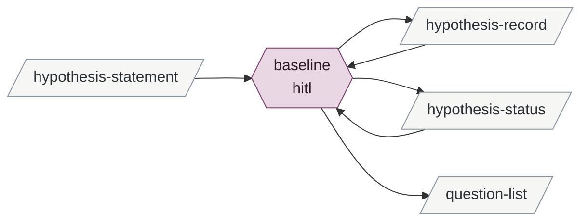

# baselining-a-hypothesis

Enables changing-the-planner-for-v3.

| id | mode | instruments | reads | writes | state | description |
|---|---|---|---|---|---|---|
| baseline | hitl | git | hypothesis-statement hypothesis-record hypothesis-status | hypothesis-record hypothesis-status question-list | built | Brian judges the evidence picture sufficient to act on; the session writes his entry and sets the flag |

<!-- generated:activity -->

Derived from the tables, never authored:

- **inputs**: hypothesis-statement
- **outputs**: hypothesis-record hypothesis-status question-list
- **instruments**: git
- **enabled by**: promoting-checked-candidates
- **enables**: changing-the-planner-for-v3
<!-- /generated -->

## Preconditions

The hypothesis's record holds at least one `evidence` entry bound to the current wording
and no unresolved challenging entry bound to it. Its `baselined` field is `false`.

## baseline

The session presents the statement and the current-wording entries, supporting and
challenging, with their falsifiers, and nothing else: no summary of what the evidence
means, no recommendation. If Brian raised the hypothesis for baselining himself, that is
the whole preparation; if the session is naming it as a candidate, it says so in the
words "verified support, no open challenge — review for baselining" and waits.

Brian decides. If he baselines, the session appends the `baselined` entry in his words and
sets `baselined` to the date. If he does not, nothing is written to the hypothesis; a reason
he gives that is a question about a corpus is written into that corpus's question list
with `asked-by: ad hoc`.

## Never

Sets the flag without Brian's explicit direction; baselines against an empty
current-wording record or an open challenge; paraphrases his rationale.
