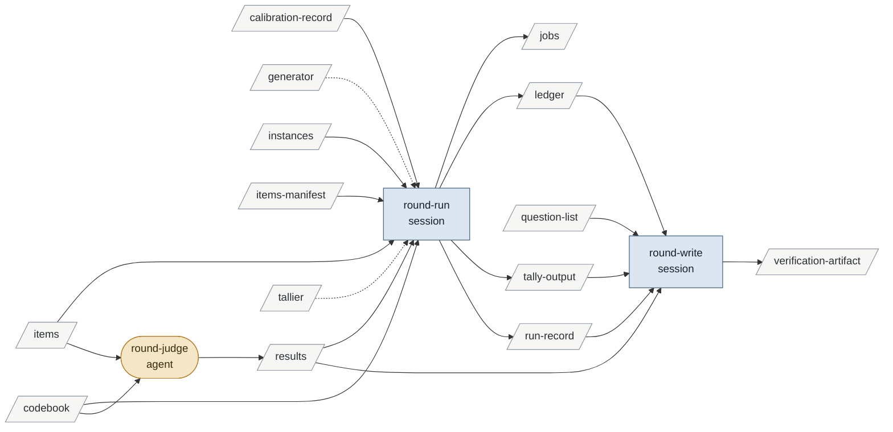

# conducting-a-verification-round

Enables writing-candidates-from-verification.

| id | mode | instruments | reads | writes | state | description |
|---|---|---|---|---|---|---|
| round-run | session | generator runner tallier | instances items items-manifest codebook calibration-record results | jobs ledger tally-output run-record | specified | On Brian's registered go: generate one job per item under the calibrated hash, dry run, batch under the host, tally the results; no pilot, calibration was it |
| round-judge | agent | | codebook items | results | specified | A classifier or auditor applies the codebook's frozen predicate to one item and emits its label in the output contract's form; the only writer of results |
| round-write | session | | results tally-output ledger run-record question-list | verification-artifact | specified | Writes round.md: method, the questions the round's items and predicates cover, counts from the tally, and any way the codebook was found wanting, for promotion to raise |

<!-- generated:activity -->

Derived from the tables, never authored:

- **inputs**: calibration-record codebook generator instances items items-manifest question-list tallier
- **outputs**: jobs ledger results run-record tally-output verification-artifact
- **instruments**: generator runner tallier
- **enabled by**: preparing-to-verify-a-corpus
- **enables**: writing-candidates-from-verification
<!-- /generated -->

## Preconditions

The instance is in the registry with Brian's go. The corpus's codebook at its current
version has a calibration record at its hash, and its items and manifest exist from
preparing-to-verify-a-corpus. Every open question the round is to answer is covered by a
predicate in that codebook; a question it does not cover is not this round's and goes
back through preparing.

## round-run

One run folder under `fanout/<instance>/<run>/`. The generator writes one job per item
from the manifest, each carrying the codebook at its calibrated hash, the item, the output
contract's markers and neutral names; the dry run composes and sizes every prompt and
launches nothing; the batch runs under the host per the `agent-runner` skill, and the
tallier reduces `results/` to `tally.md`. No pilot job: the codebook's calibration was its
pilot. A later round under the same hash over new items is a new run folder, not an edit.

## round-judge

Instructed by the corpus's codebook and nothing else; Sonnet by default; tools Read and
Write; no MCP, since the item was pre-fetched by the itemizer. One item in, one labelled
result out in the contract's form. An item the codebook cannot classify is labelled with
the class the codebook reserves for that, never left blank.

## round-write

The session writes `docs/v3-framework/<instance>/round.md`: the method (codebook id and
hash, calibration record, itemizer and item count, generator, models, harness, run
folders and ledgers, what was not measured); the questions answered, by title, being
those whose predicates the codebook froze and whose items the run covered; the counts
from `tally.md`, each table citing its tallier and run. Per-item results are cited, not
copied. Where the tally shows the codebook wanting — a class the items keep falling
outside, a rule the results split on — the session records it in `round.md`
§ Corrections as a fact about the round; the question it raises is Brian's, in the
promotion session.

## Never

Revises the codebook after the batch has started (a revision is a new version, a new
calibration and a re-run); writes a candidate, a falsifier or a question; runs a job under
a hash with no calibration record; reads an intermediate analysis in place of the item.
