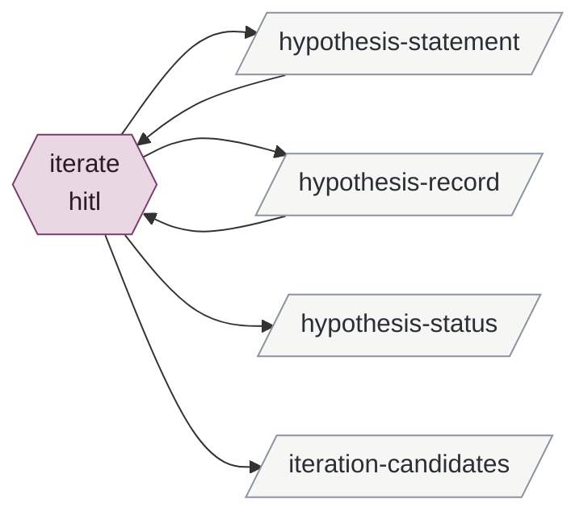

# iterating-a-statement

Enables refereeing-a-candidate.

| id | mode | instruments | reads | writes | state | description |
|---|---|---|---|---|---|---|
| iterate | hitl | git | hypothesis-statement hypothesis-record | hypothesis-statement hypothesis-record hypothesis-status iteration-candidates | specified | Brian rewords a hypothesis on evidence; the statement is edited, an iteration entry marks the boundary, status is recomputed, prior findings are queued as iteration candidates |

<!-- generated:activity -->

Derived from the tables, never authored:

- **inputs**: —
- **outputs**: hypothesis-record hypothesis-statement hypothesis-status iteration-candidates
- **instruments**: git
- **enabled by**: —
- **enables**: refereeing-a-candidate
<!-- /generated -->

## Preconditions

Brian has decided to reword, in a promotion session because evidence prompted a rethink, or
in any hitl session because a merge or split requires it; that decision is the whole
trigger, and no activity enables this one. A lead never prompts an iteration;
a lead that shows a different hypothesis is needed goes to minting-a-hypothesis.

## iterate

The session shows the current statement and the entries bound to it. Brian gives the new
wording, or approves the session's draft of it in his words. The session then, in one
commit: edits `## Hypothesis` in place; appends an `iteration` entry quoting old and new
wording and his reason, with the sentence that entries above it are bound to the prior
wording; recomputes `status` from the entries bound to the new wording, which is
`untested` when none has been re-verified, and resets `baselined` to `false`; and writes
each prior `evidence` entry's finding and source into
`fanout/referee/iterations/NNN-<date>/candidates.md` as a candidate against the new
wording, `proposed-by` citing the original instance and candidate. Those are refereed and
promoted in the next round that touches the hypothesis; nothing is re-refereed now.

For a merge or split, the same steps run in each affected file: the surviving or new
files are minted (minting-a-hypothesis), each old file gets its iteration entry naming
what replaced it, and its status is set from its own current entries, which after
supersession are none.

## Never

Edits, deletes or re-tags an entry; marks an entry superseded; re-refereees immediately;
rewords on a lead; changes a statement Brian did not word or approve.
