# map.md — generated by process-docs/StoryPlanner.DocIntegrity

Never hand-edited: `render` rewrites this file whole from the tables in SKILL.md, the activity files and artifacts.md, and the write hook rewrites it after every passing validate. Nothing here is authored.

## The activities

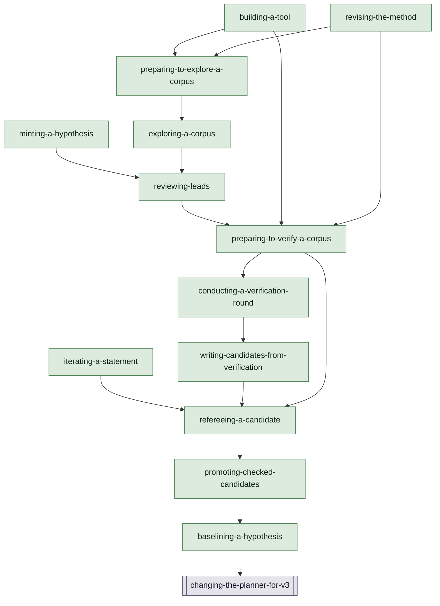

## Each activity

### baselining-a-hypothesis

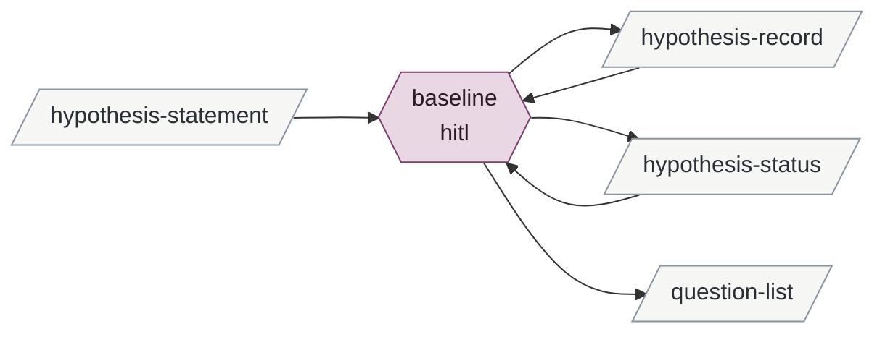

Derived from the tables, never authored:

- **inputs**: hypothesis-statement
- **outputs**: hypothesis-record hypothesis-status question-list
- **instruments**: git
- **enabled by**: promoting-checked-candidates
- **enables**: changing-the-planner-for-v3

### promoting-checked-candidates

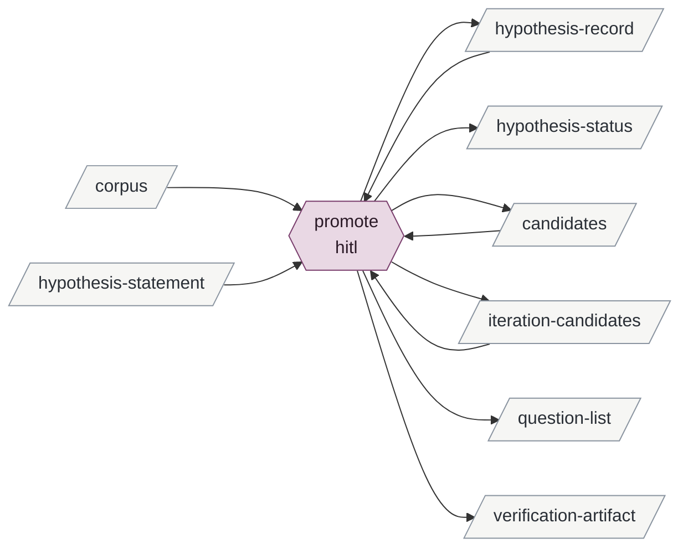

Derived from the tables, never authored:

- **inputs**: corpus hypothesis-statement
- **outputs**: candidates hypothesis-record hypothesis-status iteration-candidates question-list verification-artifact
- **instruments**: git
- **enabled by**: refereeing-a-candidate
- **enables**: baselining-a-hypothesis

### iterating-a-statement

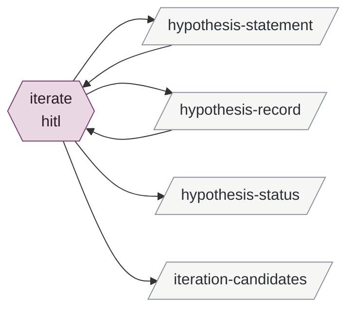

Derived from the tables, never authored:

- **inputs**: —
- **outputs**: hypothesis-record hypothesis-statement hypothesis-status iteration-candidates
- **instruments**: git
- **enabled by**: —
- **enables**: refereeing-a-candidate

### minting-a-hypothesis

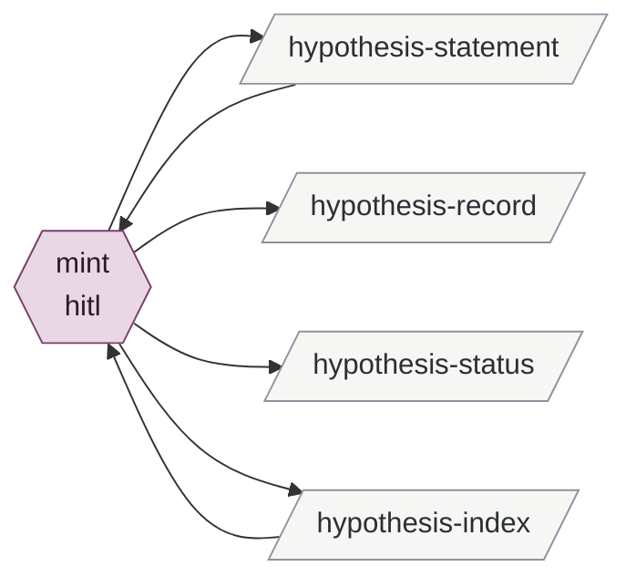

Derived from the tables, never authored:

- **inputs**: —
- **outputs**: hypothesis-index hypothesis-record hypothesis-statement hypothesis-status
- **instruments**: git
- **enabled by**: —
- **enables**: reviewing-leads

### refereeing-a-candidate

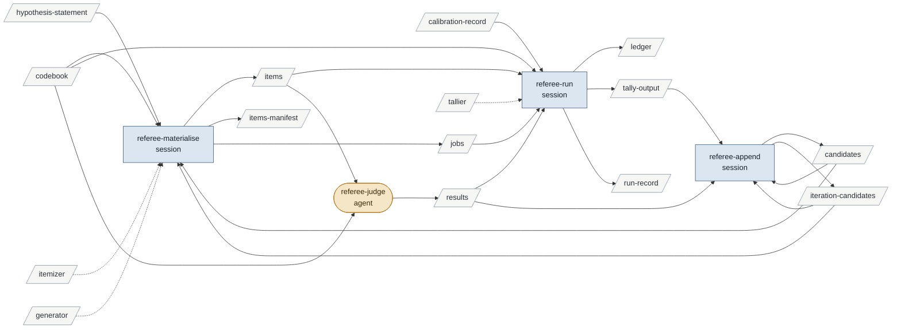

Derived from the tables, never authored:

- **inputs**: calibration-record codebook generator hypothesis-statement itemizer tallier
- **outputs**: candidates items items-manifest iteration-candidates jobs ledger results run-record tally-output
- **instruments**: generator itemizer runner tallier
- **enabled by**: iterating-a-statement writing-candidates-from-verification preparing-to-verify-a-corpus
- **enables**: promoting-checked-candidates

### writing-candidates-from-verification

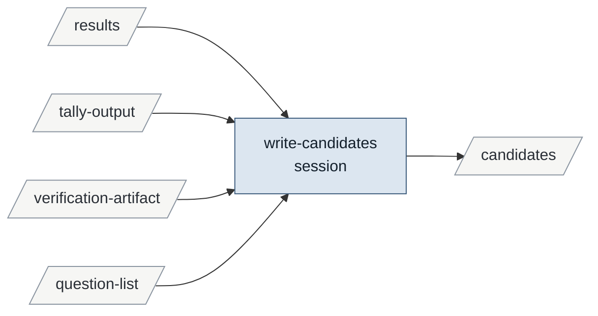

Derived from the tables, never authored:

- **inputs**: question-list results tally-output verification-artifact
- **outputs**: candidates
- **instruments**: —
- **enabled by**: conducting-a-verification-round
- **enables**: refereeing-a-candidate

### conducting-a-verification-round

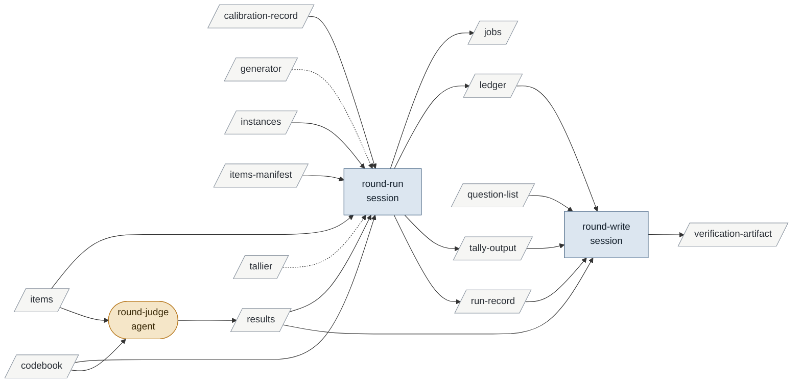

Derived from the tables, never authored:

- **inputs**: calibration-record codebook generator instances items items-manifest question-list tallier
- **outputs**: jobs ledger results run-record tally-output verification-artifact
- **instruments**: generator runner tallier
- **enabled by**: preparing-to-verify-a-corpus
- **enables**: writing-candidates-from-verification

### preparing-to-verify-a-corpus

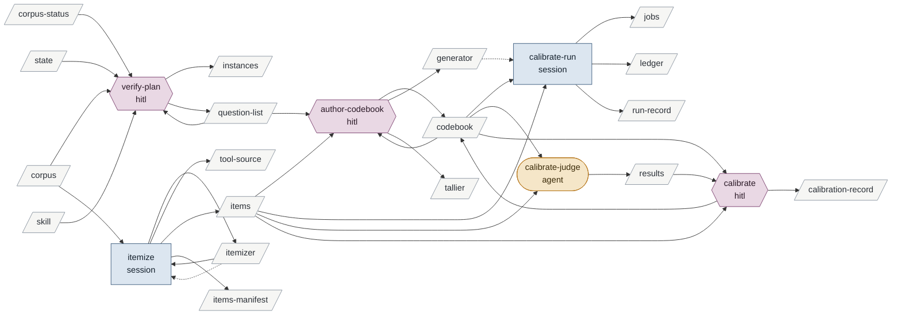

Derived from the tables, never authored:

- **inputs**: corpus corpus-status skill state
- **outputs**: calibration-record codebook generator instances itemizer items items-manifest jobs ledger question-list results run-record tallier tool-source
- **instruments**: dotnet generator itemizer runner
- **enabled by**: reviewing-leads building-a-tool revising-the-method
- **enables**: conducting-a-verification-round refereeing-a-candidate

### reviewing-leads

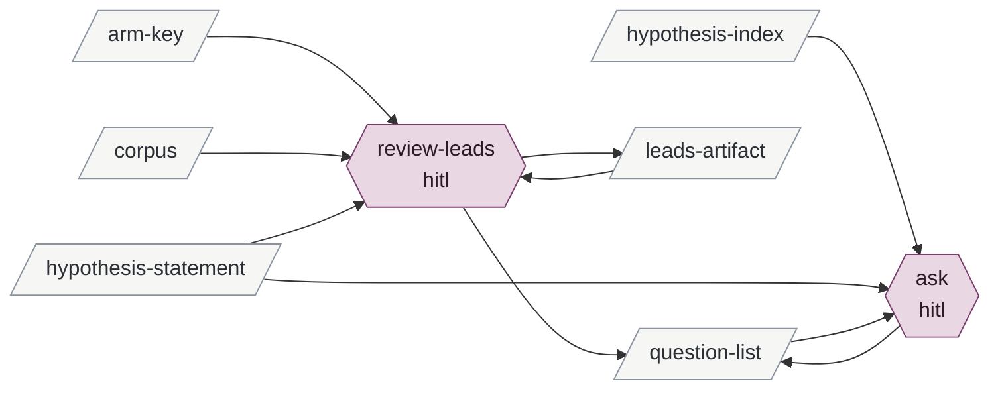

Derived from the tables, never authored:

- **inputs**: arm-key corpus hypothesis-index hypothesis-statement
- **outputs**: leads-artifact question-list
- **instruments**: git
- **enabled by**: minting-a-hypothesis exploring-a-corpus
- **enables**: preparing-to-verify-a-corpus

### exploring-a-corpus

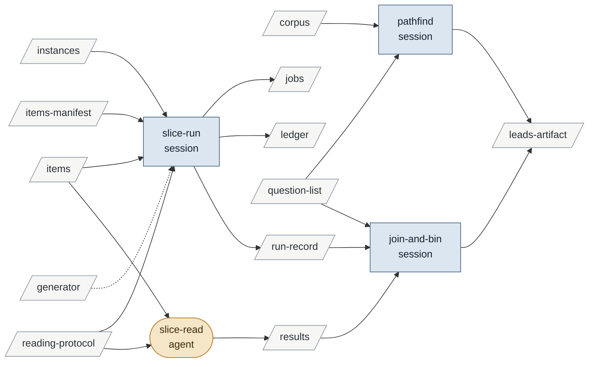

Derived from the tables, never authored:

- **inputs**: corpus generator instances items items-manifest question-list reading-protocol
- **outputs**: jobs leads-artifact ledger results run-record
- **instruments**: generator runner
- **enabled by**: preparing-to-explore-a-corpus
- **enables**: reviewing-leads

### preparing-to-explore-a-corpus

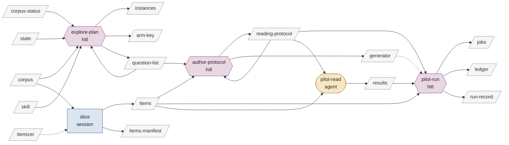

Derived from the tables, never authored:

- **inputs**: corpus corpus-status itemizer skill state
- **outputs**: arm-key generator instances items items-manifest jobs ledger question-list reading-protocol results run-record
- **instruments**: generator itemizer runner
- **enabled by**: building-a-tool revising-the-method
- **enables**: exploring-a-corpus

### building-a-tool

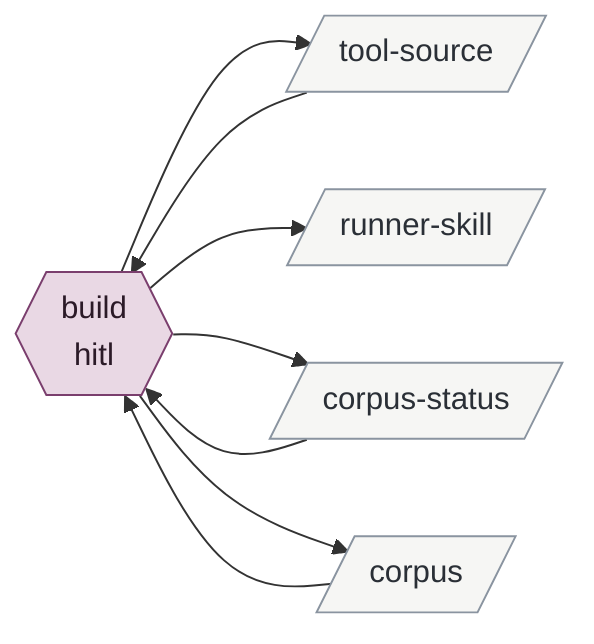

Derived from the tables, never authored:

- **inputs**: —
- **outputs**: corpus corpus-status runner-skill tool-source
- **instruments**: dotnet git
- **enabled by**: —
- **enables**: preparing-to-explore-a-corpus preparing-to-verify-a-corpus

### revising-the-method

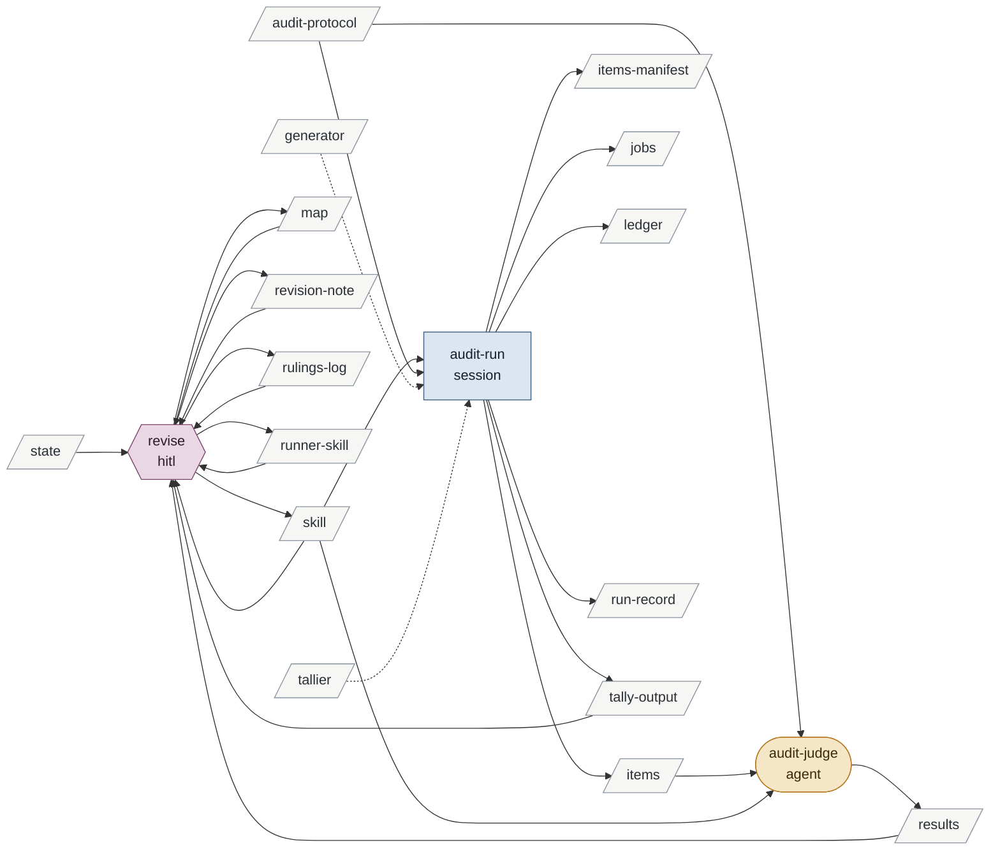

Derived from the tables, never authored:

- **inputs**: audit-protocol generator state tallier
- **outputs**: items items-manifest jobs ledger map results revision-note rulings-log run-record runner-skill skill tally-output
- **instruments**: DocIntegrity generator git runner tallier
- **enabled by**: —
- **enables**: preparing-to-explore-a-corpus preparing-to-verify-a-corpus

## The whole graph

## Consumers

| artifact | written by | read by | instrument of |
|---|---|---|---|
| hypothesis-statement | iterate mint | baseline promote iterate mint referee-materialise review-leads ask | — |
| hypothesis-record | baseline promote iterate mint | baseline promote iterate | — |
| hypothesis-status | baseline promote iterate mint | baseline | — |
| hypothesis-index | mint | mint ask | — |
| question-list | baseline promote verify-plan review-leads ask explore-plan | write-candidates round-write verify-plan author-codebook ask pathfind join-and-bin explore-plan author-protocol | — |
| instances | verify-plan explore-plan | round-run slice-run | — |
| state | — | verify-plan explore-plan revise | — |
| revision-note | revise | revise | — |
| rulings-log | revise | revise | — |
| leads-artifact | review-leads pathfind join-and-bin | review-leads | — |
| verification-artifact | promote round-write | write-candidates | — |
| arm-key | explore-plan | review-leads | — |
| candidates | promote referee-append write-candidates | promote referee-materialise referee-append | — |
| iteration-candidates | promote iterate referee-append | promote referee-materialise referee-append | — |
| corpus-status | build | verify-plan explore-plan build | — |
| codebook | author-codebook calibrate | referee-materialise referee-run referee-judge round-run round-judge author-codebook calibrate-run calibrate-judge calibrate | — |
| reading-protocol | author-protocol | slice-run slice-read author-protocol pilot-run pilot-read | — |
| calibration-record | calibrate | referee-run round-run | — |
| itemizer | itemize | itemize | referee-materialise itemize slice |
| generator | author-codebook author-protocol | — | referee-materialise round-run calibrate-run slice-run pilot-run audit-run |
| tallier | author-codebook | — | referee-run round-run audit-run |
| items | referee-materialise itemize slice audit-run | referee-run referee-judge round-run round-judge author-codebook calibrate-run calibrate-judge calibrate slice-run slice-read author-protocol pilot-run pilot-read audit-judge | — |
| items-manifest | referee-materialise itemize slice audit-run | round-run slice-run | — |
| jobs | referee-materialise round-run calibrate-run slice-run pilot-run audit-run | referee-run | — |
| ledger | referee-run round-run calibrate-run slice-run pilot-run audit-run | round-write | — |
| results | referee-judge round-judge calibrate-judge slice-read pilot-read audit-judge | referee-run referee-append write-candidates round-run round-write calibrate join-and-bin pilot-run revise | — |
| tally-output | referee-run round-run audit-run | referee-append write-candidates round-write revise | — |
| run-record | referee-run round-run calibrate-run slice-run pilot-run audit-run | round-write join-and-bin | — |
| skill | revise | verify-plan explore-plan revise audit-run audit-judge | — |
| runner-skill | build revise | revise | — |
| map | revise | revise | — |
| audit-protocol | — | audit-run audit-judge | — |
| tool-source | itemize build | build | — |
| corpus | build | promote verify-plan itemize review-leads pathfind explore-plan slice build | — |

## Validation

Last run: **passed** (4 note(s)).

| level | rule | row | message |
|---|---|---|---|
| vacuous | enables.vacuous | — | edges into the terminus are not checked for data flow, since it owns no processes: baselining-a-hypothesis → changing-the-planner-for-v3 |
| info | info.artifact.never-written | state | read by verify-plan, explore-plan, revise and written by no process; informational (generated by a tool, or authored outside the method) |
| info | info.artifact.never-written | audit-protocol | read by audit-run, audit-judge and written by no process; informational (generated by a tool, or authored outside the method) |
| info | info.instrument.free-name | instruments | instrument names that are not artifact ids: DocIntegrity, dotnet, git, runner. A program whose code is an artifact is named by its id; check none of these should have been |
