# map.md — generated by process-docs/StoryPlanner.DocIntegrity

Never hand-edited: `render` rewrites this file whole from the tables in SKILL.md and the activity files, and the write hook rewrites it after every passing check. Nothing here is authored.

## The activities

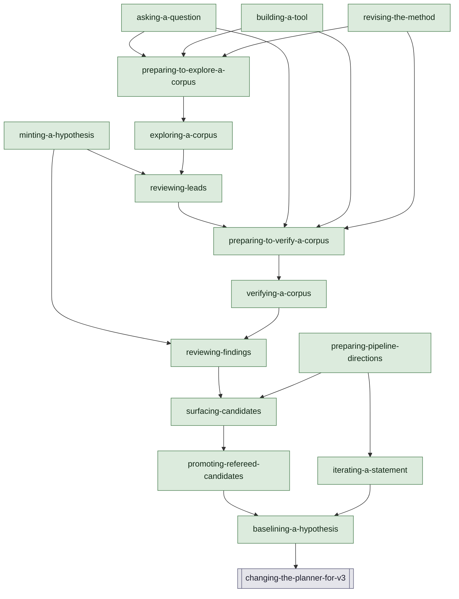

## Each activity

### baselining-a-hypothesis

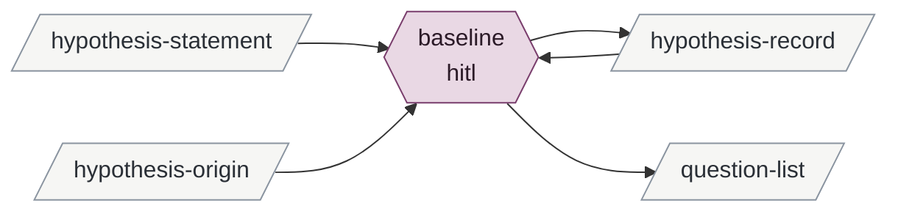

Derived from the tables, never authored:

- **inputs**: hypothesis-origin hypothesis-statement
- **outputs**: hypothesis-record question-list
- **instruments**: —
- **enabled by**: promoting-refereed-candidates iterating-a-statement
- **enables**: changing-the-planner-for-v3

### promoting-refereed-candidates

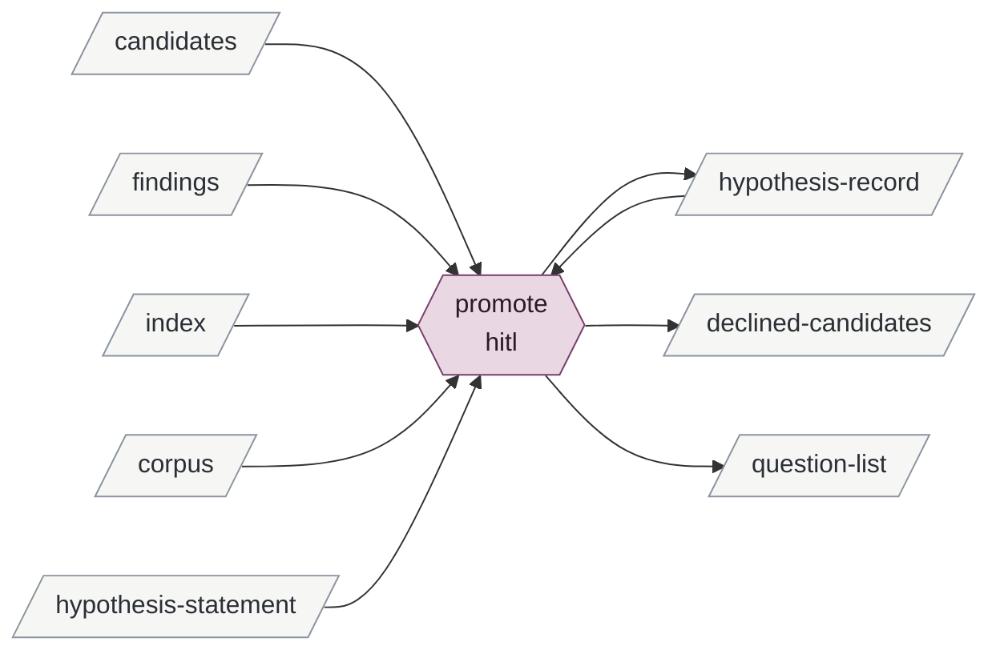

Derived from the tables, never authored:

- **inputs**: candidates corpus findings hypothesis-statement index
- **outputs**: declined-candidates hypothesis-record question-list
- **instruments**: DocIntegrity
- **enabled by**: surfacing-candidates
- **enables**: baselining-a-hypothesis

### iterating-a-statement

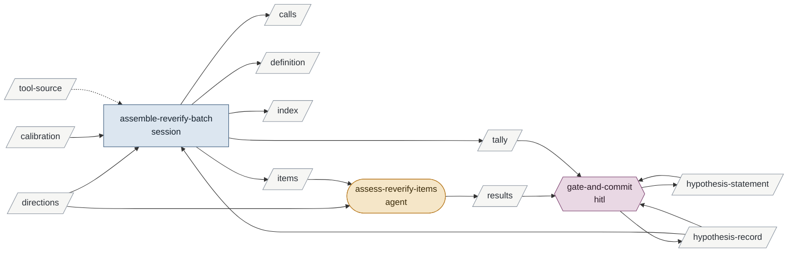

Derived from the tables, never authored:

- **inputs**: calibration directions tool-source
- **outputs**: calls definition hypothesis-record hypothesis-statement index items results tally
- **instruments**: git runner tool-source
- **enabled by**: preparing-pipeline-directions
- **enables**: baselining-a-hypothesis

### minting-a-hypothesis

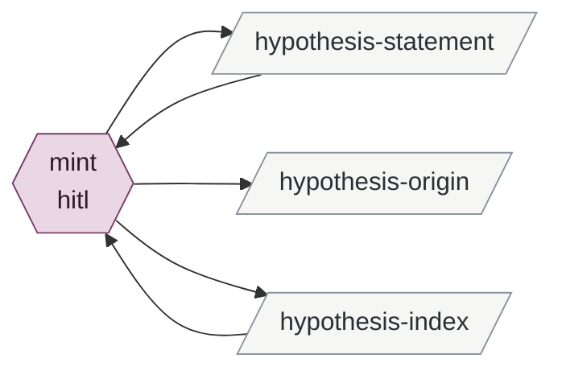

Derived from the tables, never authored:

- **inputs**: —
- **outputs**: hypothesis-index hypothesis-origin hypothesis-statement
- **instruments**: —
- **enabled by**: —
- **enables**: reviewing-leads reviewing-findings

### surfacing-candidates

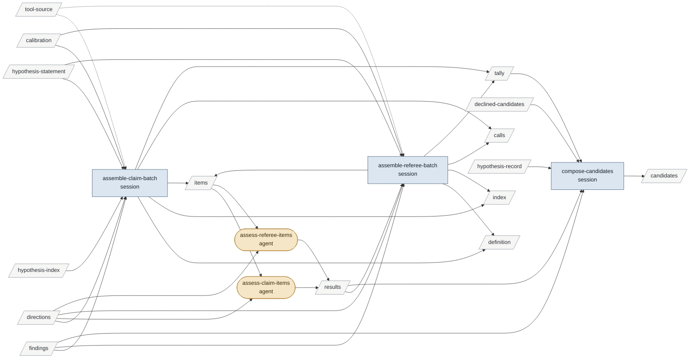

Derived from the tables, never authored:

- **inputs**: calibration declined-candidates directions findings hypothesis-index hypothesis-record hypothesis-statement tool-source
- **outputs**: calls candidates definition index items results tally
- **instruments**: DocIntegrity runner tool-source
- **enabled by**: reviewing-findings preparing-pipeline-directions
- **enables**: promoting-refereed-candidates

### reviewing-findings

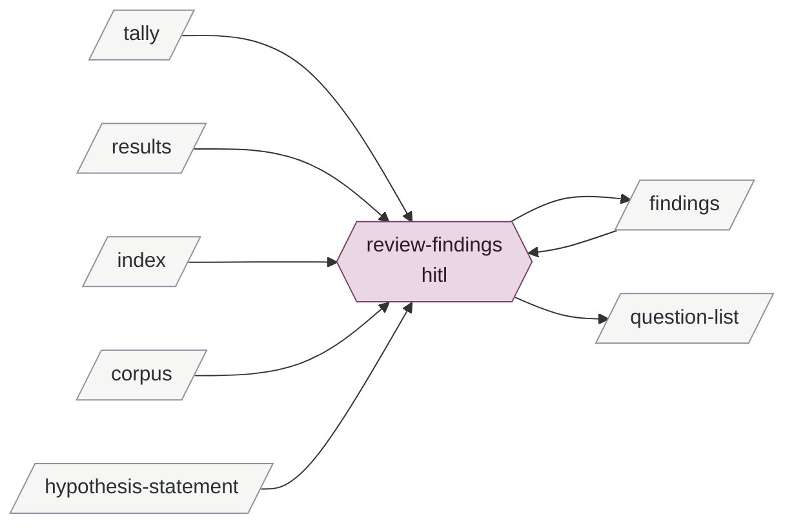

Derived from the tables, never authored:

- **inputs**: corpus hypothesis-statement index results tally
- **outputs**: findings question-list
- **instruments**: —
- **enabled by**: minting-a-hypothesis verifying-a-corpus
- **enables**: surfacing-candidates

### verifying-a-corpus

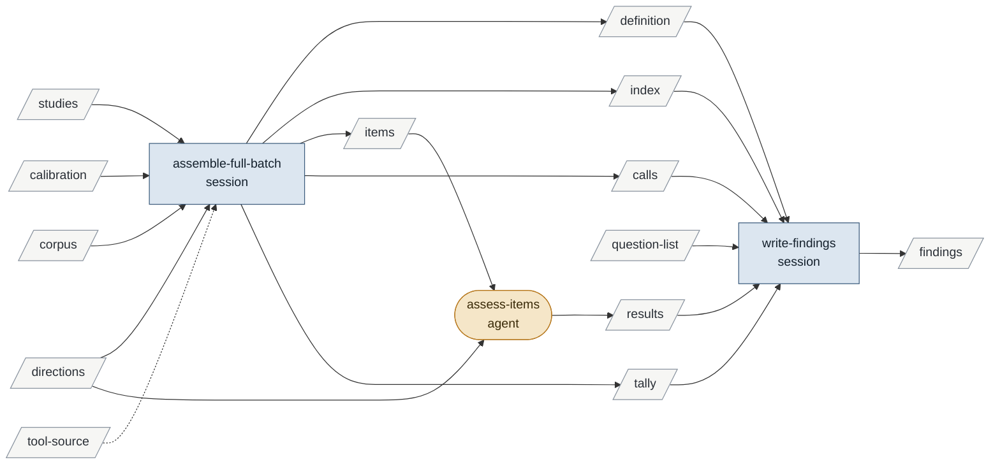

Derived from the tables, never authored:

- **inputs**: calibration corpus directions question-list studies tool-source
- **outputs**: calls definition findings index items results tally
- **instruments**: runner tool-source
- **enabled by**: preparing-to-verify-a-corpus
- **enables**: reviewing-findings

### preparing-to-verify-a-corpus

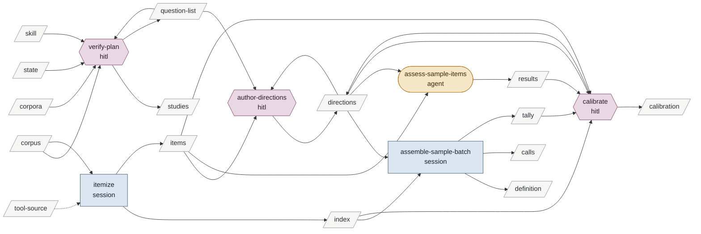

Derived from the tables, never authored:

- **inputs**: corpora corpus skill state tool-source
- **outputs**: calibration calls definition directions index items question-list results studies tally
- **instruments**: dotnet runner tool-source
- **enabled by**: reviewing-leads asking-a-question building-a-tool revising-the-method
- **enables**: verifying-a-corpus

### preparing-pipeline-directions

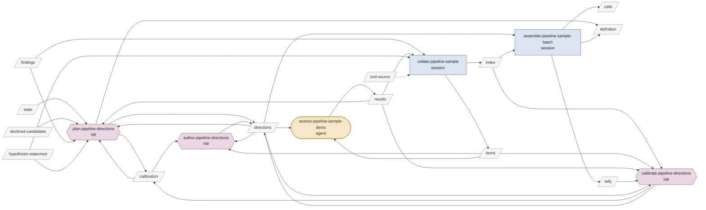

Derived from the tables, never authored:

- **inputs**: declined-candidates findings hypothesis-statement state tool-source
- **outputs**: calibration calls definition directions index items results tally
- **instruments**: dotnet runner tool-source
- **enabled by**: —
- **enables**: surfacing-candidates iterating-a-statement

### reviewing-leads

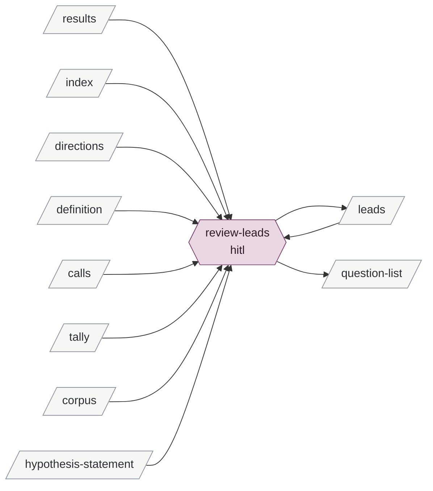

Derived from the tables, never authored:

- **inputs**: calls corpus definition directions hypothesis-statement index results tally
- **outputs**: leads question-list
- **instruments**: —
- **enabled by**: minting-a-hypothesis exploring-a-corpus
- **enables**: preparing-to-verify-a-corpus

### exploring-a-corpus

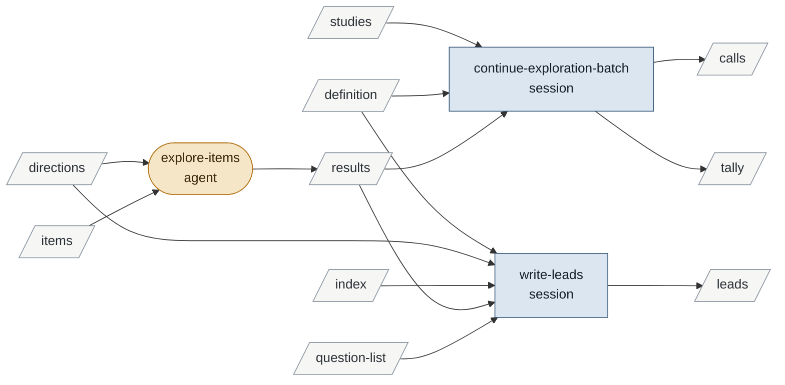

Derived from the tables, never authored:

- **inputs**: definition directions index items question-list studies
- **outputs**: calls leads results tally
- **instruments**: runner
- **enabled by**: preparing-to-explore-a-corpus
- **enables**: reviewing-leads

### preparing-to-explore-a-corpus

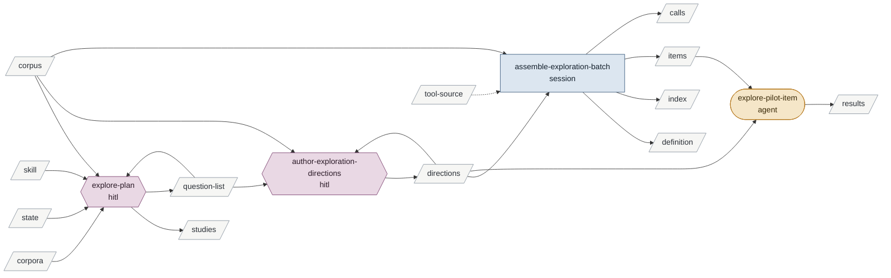

Derived from the tables, never authored:

- **inputs**: corpora corpus skill state tool-source
- **outputs**: calls definition directions index items question-list results studies
- **instruments**: runner tool-source
- **enabled by**: asking-a-question building-a-tool revising-the-method
- **enables**: exploring-a-corpus

### asking-a-question

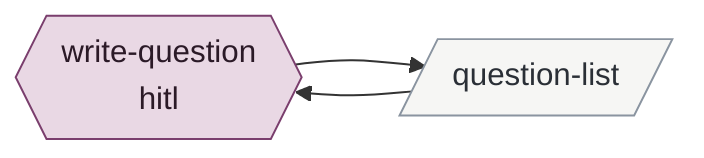

Derived from the tables, never authored:

- **inputs**: —
- **outputs**: question-list
- **instruments**: —
- **enabled by**: —
- **enables**: preparing-to-explore-a-corpus preparing-to-verify-a-corpus

### building-a-tool

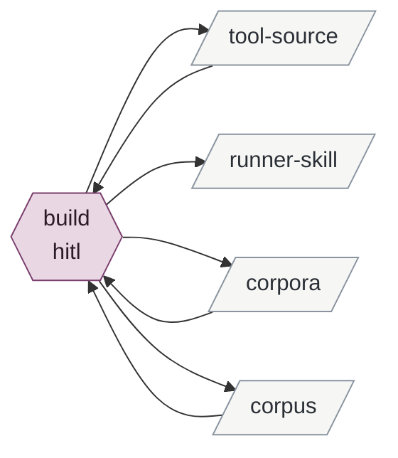

Derived from the tables, never authored:

- **inputs**: —
- **outputs**: corpora corpus runner-skill tool-source
- **instruments**: dotnet git
- **enabled by**: —
- **enables**: preparing-to-explore-a-corpus preparing-to-verify-a-corpus

### revising-the-method

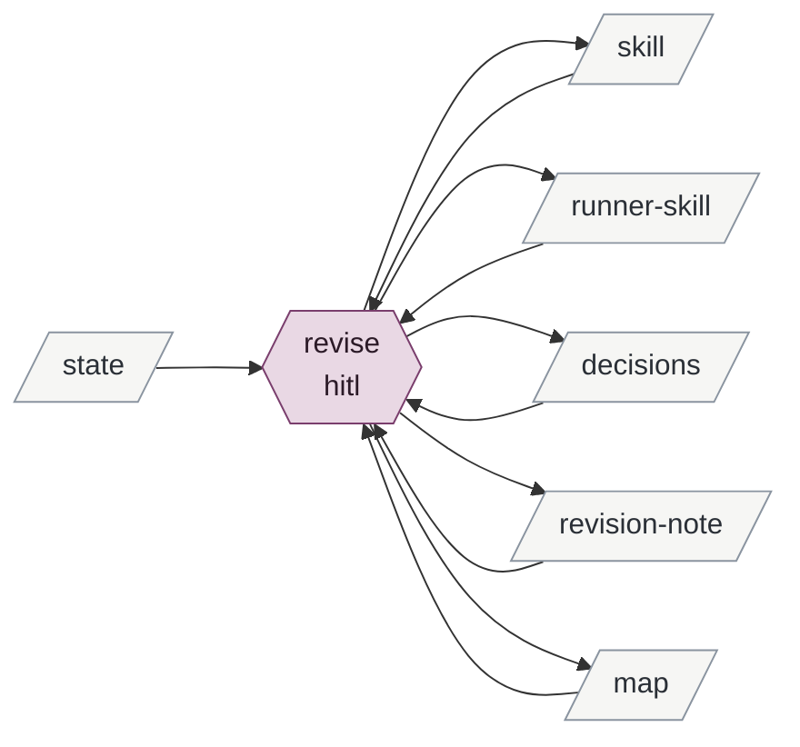

Derived from the tables, never authored:

- **inputs**: state
- **outputs**: decisions map revision-note runner-skill skill
- **instruments**: DocIntegrity git
- **enabled by**: —
- **enables**: preparing-to-explore-a-corpus preparing-to-verify-a-corpus

## The whole graph

```mermaid
flowchart TD
  classDef hitl fill:#e9d8e4,stroke:#7a3e6d,color:#2b1a27
  classDef session fill:#dce6f0,stroke:#3b5b7c,color:#14202c
  classDef agent fill:#f5e6c8,stroke:#b7791f,color:#3a2a08
  classDef artifact fill:#f6f6f4,stroke:#8a94a0,color:#2a2f36
  classDef activity fill:#dcebdd,stroke:#4b7f52,color:#122816
  classDef terminus fill:#e4e4ea,stroke:#5b5b7a,color:#1c1c2c
  subgraph baseliningahypothesis["baselining-a-hypothesis"]
    baseline{{"baseline<br/>hitl"}}:::hitl
  end
  subgraph promotingrefereedcandidates["promoting-refereed-candidates"]
    promote{{"promote<br/>hitl"}}:::hitl
  end
  subgraph iteratingastatement["iterating-a-statement"]
    assemblereverifybatch["assemble-reverify-batch<br/>session"]:::session
    assessreverifyitems(["assess-reverify-items<br/>agent"]):::agent
    gateandcommit{{"gate-and-commit<br/>hitl"}}:::hitl
  end
  subgraph mintingahypothesis["minting-a-hypothesis"]
    mint{{"mint<br/>hitl"}}:::hitl
  end
  subgraph surfacingcandidates["surfacing-candidates"]
    assembleclaimbatch["assemble-claim-batch<br/>session"]:::session
    assessclaimitems(["assess-claim-items<br/>agent"]):::agent
    assemblerefereebatch["assemble-referee-batch<br/>session"]:::session
    assessrefereeitems(["assess-referee-items<br/>agent"]):::agent
    composecandidates["compose-candidates<br/>session"]:::session
  end
  subgraph reviewingfindings["reviewing-findings"]
    reviewfindings{{"review-findings<br/>hitl"}}:::hitl
  end
  subgraph verifyingacorpus["verifying-a-corpus"]
    assemblefullbatch["assemble-full-batch<br/>session"]:::session
    assessitems(["assess-items<br/>agent"]):::agent
    writefindings["write-findings<br/>session"]:::session
  end
  subgraph preparingtoverifyacorpus["preparing-to-verify-a-corpus"]
    verifyplan{{"verify-plan<br/>hitl"}}:::hitl
    itemize["itemize<br/>session"]:::session
    authordirections{{"author-directions<br/>hitl"}}:::hitl
    assemblesamplebatch["assemble-sample-batch<br/>session"]:::session
    assesssampleitems(["assess-sample-items<br/>agent"]):::agent
    calibrate{{"calibrate<br/>hitl"}}:::hitl
  end
  subgraph preparingpipelinedirections["preparing-pipeline-directions"]
    planpipelinedirections{{"plan-pipeline-directions<br/>hitl"}}:::hitl
    collatepipelinesample["collate-pipeline-sample<br/>session"]:::session
    authorpipelinedirections{{"author-pipeline-directions<br/>hitl"}}:::hitl
    assemblepipelinesamplebatch["assemble-pipeline-sample-batch<br/>session"]:::session
    assesspipelinesampleitems(["assess-pipeline-sample-items<br/>agent"]):::agent
    calibratepipelinedirections{{"calibrate-pipeline-directions<br/>hitl"}}:::hitl
  end
  subgraph reviewingleads["reviewing-leads"]
    reviewleads{{"review-leads<br/>hitl"}}:::hitl
  end
  subgraph exploringacorpus["exploring-a-corpus"]
    continueexplorationbatch["continue-exploration-batch<br/>session"]:::session
    exploreitems(["explore-items<br/>agent"]):::agent
    writeleads["write-leads<br/>session"]:::session
  end
  subgraph preparingtoexploreacorpus["preparing-to-explore-a-corpus"]
    exploreplan{{"explore-plan<br/>hitl"}}:::hitl
    authorexplorationdirections{{"author-exploration-directions<br/>hitl"}}:::hitl
    assembleexplorationbatch["assemble-exploration-batch<br/>session"]:::session
    explorepilotitem(["explore-pilot-item<br/>agent"]):::agent
  end
  subgraph askingaquestion["asking-a-question"]
    writequestion{{"write-question<br/>hitl"}}:::hitl
  end
  subgraph buildingatool["building-a-tool"]
    build{{"build<br/>hitl"}}:::hitl
  end
  subgraph revisingthemethod["revising-the-method"]
    revise{{"revise<br/>hitl"}}:::hitl
  end
  hypothesisstatement[/"hypothesis-statement"/]:::artifact
  hypothesisorigin[/"hypothesis-origin"/]:::artifact
  hypothesisrecord[/"hypothesis-record"/]:::artifact
  hypothesisindex[/"hypothesis-index"/]:::artifact
  questionlist[/"question-list"/]:::artifact
  studies[/"studies"/]:::artifact
  state[/"state"/]:::artifact
  revisionnote[/"revision-note"/]:::artifact
  decisions[/"decisions"/]:::artifact
  leads[/"leads"/]:::artifact
  findings[/"findings"/]:::artifact
  candidates[/"candidates"/]:::artifact
  declinedcandidates[/"declined-candidates"/]:::artifact
  corpora[/"corpora"/]:::artifact
  directions[/"directions"/]:::artifact
  calibration[/"calibration"/]:::artifact
  definition[/"definition"/]:::artifact
  index[/"index"/]:::artifact
  items[/"items"/]:::artifact
  calls[/"calls"/]:::artifact
  results[/"results"/]:::artifact
  tally[/"tally"/]:::artifact
  skill[/"skill"/]:::artifact
  runnerskill[/"runner-skill"/]:::artifact
  map[/"map"/]:::artifact
  toolsource[/"tool-source"/]:::artifact
  corpus[/"corpus"/]:::artifact

  hypothesisstatement --> baseline
  hypothesisorigin --> baseline
  hypothesisrecord --> baseline
  baseline --> hypothesisrecord
  baseline --> questionlist
  candidates --> promote
  findings --> promote
  index --> promote
  corpus --> promote
  hypothesisstatement --> promote
  hypothesisrecord --> promote
  promote --> hypothesisrecord
  promote --> declinedcandidates
  promote --> questionlist
  hypothesisrecord --> assemblereverifybatch
  directions --> assemblereverifybatch
  calibration --> assemblereverifybatch
  toolsource -.-> assemblereverifybatch
  assemblereverifybatch --> definition
  assemblereverifybatch --> index
  assemblereverifybatch --> items
  assemblereverifybatch --> calls
  assemblereverifybatch --> tally
  directions --> assessreverifyitems
  items --> assessreverifyitems
  assessreverifyitems --> results
  results --> gateandcommit
  tally --> gateandcommit
  hypothesisstatement --> gateandcommit
  hypothesisrecord --> gateandcommit
  gateandcommit --> hypothesisstatement
  gateandcommit --> hypothesisrecord
  hypothesisindex --> mint
  hypothesisstatement --> mint
  mint --> hypothesisstatement
  mint --> hypothesisorigin
  mint --> hypothesisindex
  findings --> assembleclaimbatch
  hypothesisstatement --> assembleclaimbatch
  hypothesisindex --> assembleclaimbatch
  directions --> assembleclaimbatch
  calibration --> assembleclaimbatch
  toolsource -.-> assembleclaimbatch
  assembleclaimbatch --> definition
  assembleclaimbatch --> index
  assembleclaimbatch --> items
  assembleclaimbatch --> calls
  assembleclaimbatch --> tally
  directions --> assessclaimitems
  items --> assessclaimitems
  assessclaimitems --> results
  results --> assemblerefereebatch
  findings --> assemblerefereebatch
  hypothesisstatement --> assemblerefereebatch
  directions --> assemblerefereebatch
  calibration --> assemblerefereebatch
  toolsource -.-> assemblerefereebatch
  assemblerefereebatch --> definition
  assemblerefereebatch --> index
  assemblerefereebatch --> items
  assemblerefereebatch --> calls
  assemblerefereebatch --> tally
  directions --> assessrefereeitems
  items --> assessrefereeitems
  assessrefereeitems --> results
  results --> composecandidates
  tally --> composecandidates
  findings --> composecandidates
  declinedcandidates --> composecandidates
  hypothesisrecord --> composecandidates
  composecandidates --> candidates
  findings --> reviewfindings
  tally --> reviewfindings
  results --> reviewfindings
  index --> reviewfindings
  corpus --> reviewfindings
  hypothesisstatement --> reviewfindings
  reviewfindings --> findings
  reviewfindings --> questionlist
  studies --> assemblefullbatch
  directions --> assemblefullbatch
  calibration --> assemblefullbatch
  corpus --> assemblefullbatch
  toolsource -.-> assemblefullbatch
  assemblefullbatch --> definition
  assemblefullbatch --> index
  assemblefullbatch --> items
  assemblefullbatch --> calls
  assemblefullbatch --> tally
  directions --> assessitems
  items --> assessitems
  assessitems --> results
  definition --> writefindings
  index --> writefindings
  calls --> writefindings
  results --> writefindings
  tally --> writefindings
  questionlist --> writefindings
  writefindings --> findings
  questionlist --> verifyplan
  corpora --> verifyplan
  corpus --> verifyplan
  state --> verifyplan
  skill --> verifyplan
  verifyplan --> studies
  verifyplan --> questionlist
  corpus --> itemize
  toolsource -.-> itemize
  itemize --> index
  itemize --> items
  questionlist --> authordirections
  items --> authordirections
  directions --> authordirections
  authordirections --> directions
  directions --> assemblesamplebatch
  index --> assemblesamplebatch
  assemblesamplebatch --> definition
  assemblesamplebatch --> calls
  assemblesamplebatch --> tally
  directions --> assesssampleitems
  items --> assesssampleitems
  assesssampleitems --> results
  index --> calibrate
  items --> calibrate
  results --> calibrate
  tally --> calibrate
  directions --> calibrate
  calibrate --> calibration
  calibrate --> directions
  state --> planpipelinedirections
  directions --> planpipelinedirections
  calibration --> planpipelinedirections
  declinedcandidates --> planpipelinedirections
  findings --> planpipelinedirections
  results --> planpipelinedirections
  hypothesisstatement --> planpipelinedirections
  planpipelinedirections --> definition
  planpipelinedirections --> calibration
  planpipelinedirections --> directions
  findings --> collatepipelinesample
  results --> collatepipelinesample
  hypothesisstatement --> collatepipelinesample
  toolsource -.-> collatepipelinesample
  collatepipelinesample --> index
  collatepipelinesample --> items
  items --> authorpipelinedirections
  directions --> authorpipelinedirections
  calibration --> authorpipelinedirections
  authorpipelinedirections --> directions
  directions --> assemblepipelinesamplebatch
  index --> assemblepipelinesamplebatch
  assemblepipelinesamplebatch --> definition
  assemblepipelinesamplebatch --> calls
  assemblepipelinesamplebatch --> tally
  directions --> assesspipelinesampleitems
  items --> assesspipelinesampleitems
  assesspipelinesampleitems --> results
  index --> calibratepipelinedirections
  items --> calibratepipelinedirections
  results --> calibratepipelinedirections
  tally --> calibratepipelinedirections
  directions --> calibratepipelinedirections
  calibratepipelinedirections --> calibration
  calibratepipelinedirections --> directions
  leads --> reviewleads
  results --> reviewleads
  index --> reviewleads
  directions --> reviewleads
  definition --> reviewleads
  calls --> reviewleads
  tally --> reviewleads
  corpus --> reviewleads
  hypothesisstatement --> reviewleads
  reviewleads --> leads
  reviewleads --> questionlist
  studies --> continueexplorationbatch
  definition --> continueexplorationbatch
  results --> continueexplorationbatch
  continueexplorationbatch --> calls
  continueexplorationbatch --> tally
  directions --> exploreitems
  items --> exploreitems
  exploreitems --> results
  definition --> writeleads
  directions --> writeleads
  index --> writeleads
  results --> writeleads
  questionlist --> writeleads
  writeleads --> leads
  questionlist --> exploreplan
  corpora --> exploreplan
  corpus --> exploreplan
  state --> exploreplan
  skill --> exploreplan
  exploreplan --> studies
  exploreplan --> questionlist
  questionlist --> authorexplorationdirections
  corpus --> authorexplorationdirections
  directions --> authorexplorationdirections
  authorexplorationdirections --> directions
  directions --> assembleexplorationbatch
  corpus --> assembleexplorationbatch
  toolsource -.-> assembleexplorationbatch
  assembleexplorationbatch --> definition
  assembleexplorationbatch --> index
  assembleexplorationbatch --> items
  assembleexplorationbatch --> calls
  directions --> explorepilotitem
  items --> explorepilotitem
  explorepilotitem --> results
  questionlist --> writequestion
  writequestion --> questionlist
  corpora --> build
  toolsource --> build
  corpus --> build
  build --> toolsource
  build --> runnerskill
  build --> corpora
  build --> corpus
  skill --> revise
  runnerskill --> revise
  map --> revise
  state --> revise
  revisionnote --> revise
  decisions --> revise
  revise --> skill
  revise --> runnerskill
  revise --> decisions
  revise --> revisionnote
  revise --> map
```

## Consumers

| artifact | written by | read by | instrument of |
|---|---|---|---|
| hypothesis-statement | gate-and-commit mint | baseline promote gate-and-commit mint assemble-claim-batch assemble-referee-batch review-findings plan-pipeline-directions collate-pipeline-sample review-leads | — |
| hypothesis-origin | mint | baseline | — |
| hypothesis-record | baseline promote gate-and-commit | baseline promote assemble-reverify-batch gate-and-commit compose-candidates | — |
| hypothesis-index | mint | mint assemble-claim-batch | — |
| question-list | baseline promote review-findings verify-plan review-leads explore-plan write-question | write-findings verify-plan author-directions write-leads explore-plan author-exploration-directions write-question | — |
| studies | verify-plan explore-plan | assemble-full-batch continue-exploration-batch | — |
| state | — | verify-plan plan-pipeline-directions explore-plan revise | — |
| revision-note | revise | revise | — |
| decisions | revise | revise | — |
| leads | review-leads write-leads | review-leads | — |
| findings | review-findings write-findings | promote assemble-claim-batch assemble-referee-batch compose-candidates review-findings plan-pipeline-directions collate-pipeline-sample | — |
| candidates | compose-candidates | promote | — |
| declined-candidates | promote | compose-candidates plan-pipeline-directions | — |
| corpora | build | verify-plan explore-plan build | — |
| directions | author-directions calibrate plan-pipeline-directions author-pipeline-directions calibrate-pipeline-directions author-exploration-directions | assemble-reverify-batch assess-reverify-items assemble-claim-batch assess-claim-items assemble-referee-batch assess-referee-items assemble-full-batch assess-items author-directions assemble-sample-batch assess-sample-items calibrate plan-pipeline-directions author-pipeline-directions assemble-pipeline-sample-batch assess-pipeline-sample-items calibrate-pipeline-directions review-leads explore-items write-leads author-exploration-directions assemble-exploration-batch explore-pilot-item | — |
| calibration | calibrate plan-pipeline-directions calibrate-pipeline-directions | assemble-reverify-batch assemble-claim-batch assemble-referee-batch assemble-full-batch plan-pipeline-directions author-pipeline-directions | — |
| definition | assemble-reverify-batch assemble-claim-batch assemble-referee-batch assemble-full-batch assemble-sample-batch plan-pipeline-directions assemble-pipeline-sample-batch assemble-exploration-batch | write-findings review-leads continue-exploration-batch write-leads | — |
| index | assemble-reverify-batch assemble-claim-batch assemble-referee-batch assemble-full-batch itemize collate-pipeline-sample assemble-exploration-batch | promote review-findings write-findings assemble-sample-batch calibrate assemble-pipeline-sample-batch calibrate-pipeline-directions review-leads write-leads | — |
| items | assemble-reverify-batch assemble-claim-batch assemble-referee-batch assemble-full-batch itemize collate-pipeline-sample assemble-exploration-batch | assess-reverify-items assess-claim-items assess-referee-items assess-items author-directions assess-sample-items calibrate author-pipeline-directions assess-pipeline-sample-items calibrate-pipeline-directions explore-items explore-pilot-item | — |
| calls | assemble-reverify-batch assemble-claim-batch assemble-referee-batch assemble-full-batch assemble-sample-batch assemble-pipeline-sample-batch continue-exploration-batch assemble-exploration-batch | write-findings review-leads | — |
| results | assess-reverify-items assess-claim-items assess-referee-items assess-items assess-sample-items assess-pipeline-sample-items explore-items explore-pilot-item | gate-and-commit assemble-referee-batch compose-candidates review-findings write-findings calibrate plan-pipeline-directions collate-pipeline-sample calibrate-pipeline-directions review-leads continue-exploration-batch write-leads | — |
| tally | assemble-reverify-batch assemble-claim-batch assemble-referee-batch assemble-full-batch assemble-sample-batch assemble-pipeline-sample-batch continue-exploration-batch | gate-and-commit compose-candidates review-findings write-findings calibrate calibrate-pipeline-directions review-leads | — |
| skill | revise | verify-plan explore-plan revise | — |
| runner-skill | build revise | revise | — |
| map | revise | revise | — |
| tool-source | build | build | assemble-reverify-batch assemble-claim-batch assemble-referee-batch assemble-full-batch itemize collate-pipeline-sample assemble-exploration-batch |
| corpus | build | promote review-findings assemble-full-batch verify-plan itemize review-leads explore-plan author-exploration-directions assemble-exploration-batch build | — |

## Validation

Last run: **passed** (3 note(s)).

| level | check | row | message |
|---|---|---|---|
| vacuous | enables.vacuous | — | edges into the terminus are not checked for data flow, since it owns no processes: baselining-a-hypothesis → changing-the-planner-for-v3 |
| info | info.artifact.never-written | state | read by verify-plan, plan-pipeline-directions, explore-plan, revise and written by no process; informational (generated by a tool, or authored outside the method) |
| info | info.instrument.free-name | instruments | instrument names that are not artifact ids: DocIntegrity, dotnet, git, runner. A program whose code is an artifact is named by its id; check none of these should have been |
