# map.md — generated by process-docs/StoryPlanner.DocIntegrity

Never hand-edited: `render` rewrites this file whole from the tables in SKILL.md and the activity files, and the write hook rewrites it after every passing check. Nothing here is authored.

## The activities

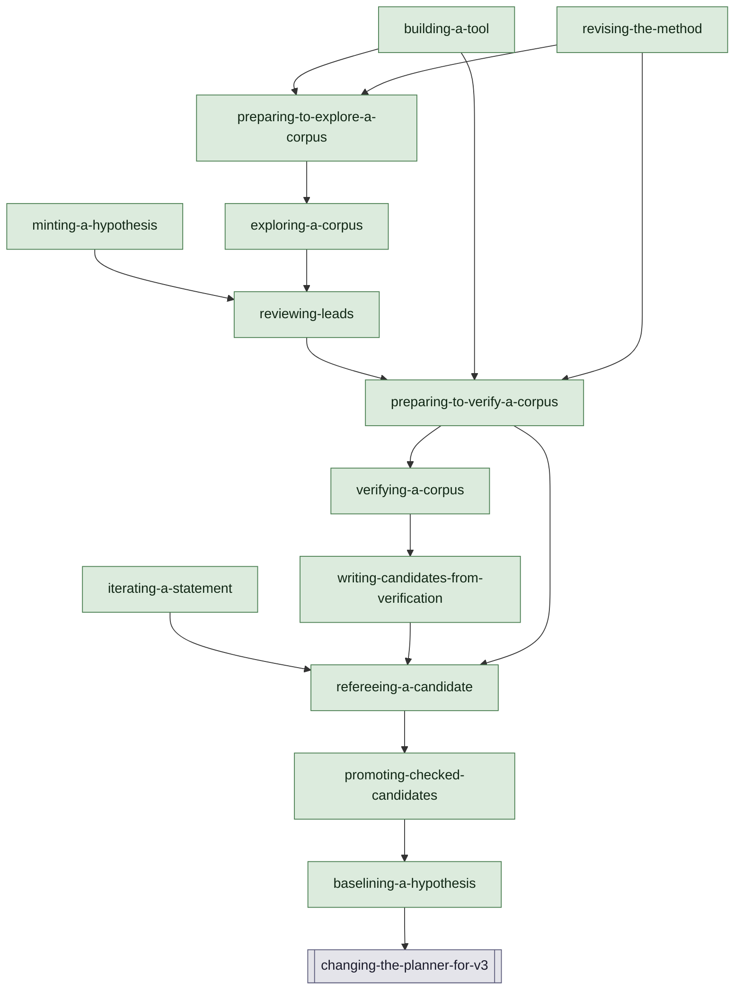

## Each activity

### baselining-a-hypothesis

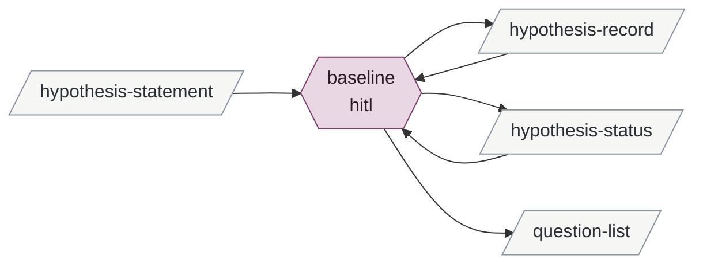

Derived from the tables, never authored:

- **inputs**: hypothesis-statement
- **outputs**: hypothesis-record hypothesis-status question-list
- **instruments**: git
- **enabled by**: promoting-checked-candidates
- **enables**: changing-the-planner-for-v3

### promoting-checked-candidates

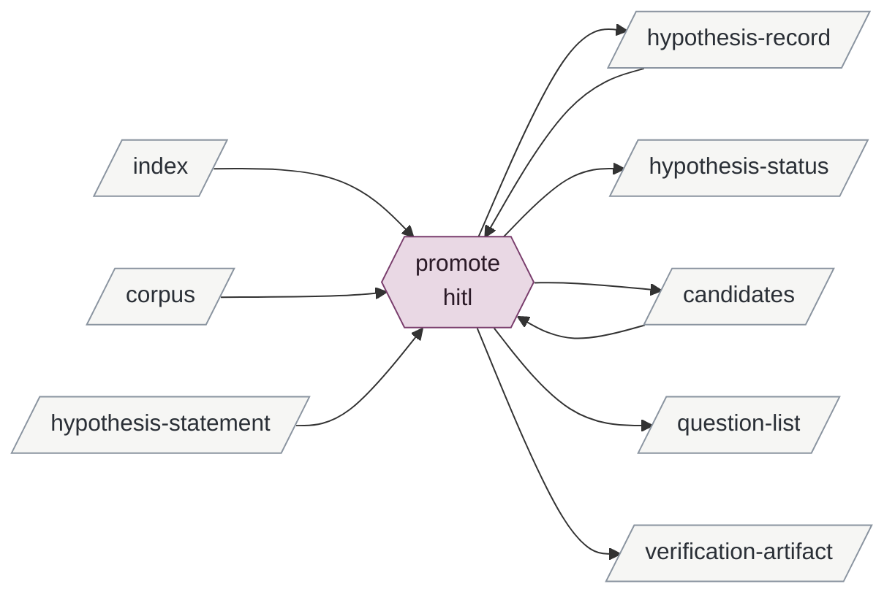

Derived from the tables, never authored:

- **inputs**: corpus hypothesis-statement index
- **outputs**: candidates hypothesis-record hypothesis-status question-list verification-artifact
- **instruments**: git
- **enabled by**: refereeing-a-candidate
- **enables**: baselining-a-hypothesis

### iterating-a-statement

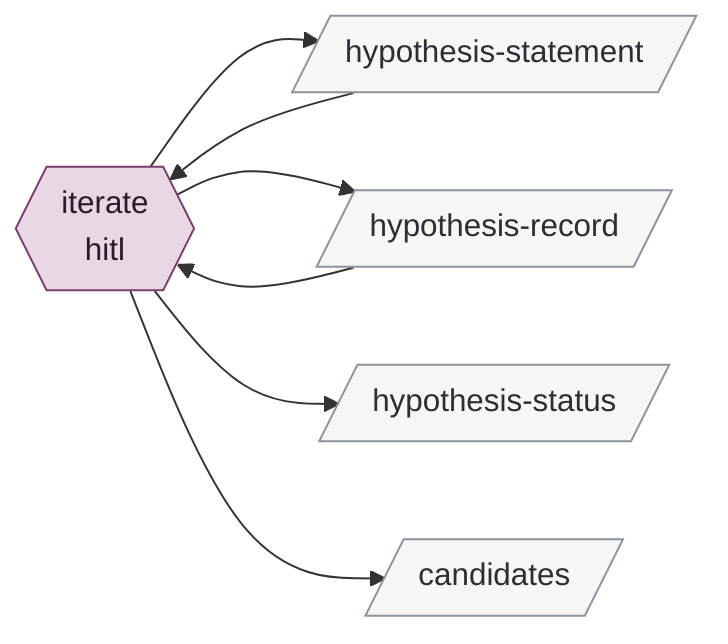

Derived from the tables, never authored:

- **inputs**: —
- **outputs**: candidates hypothesis-record hypothesis-statement hypothesis-status
- **instruments**: git
- **enabled by**: —
- **enables**: refereeing-a-candidate

### minting-a-hypothesis

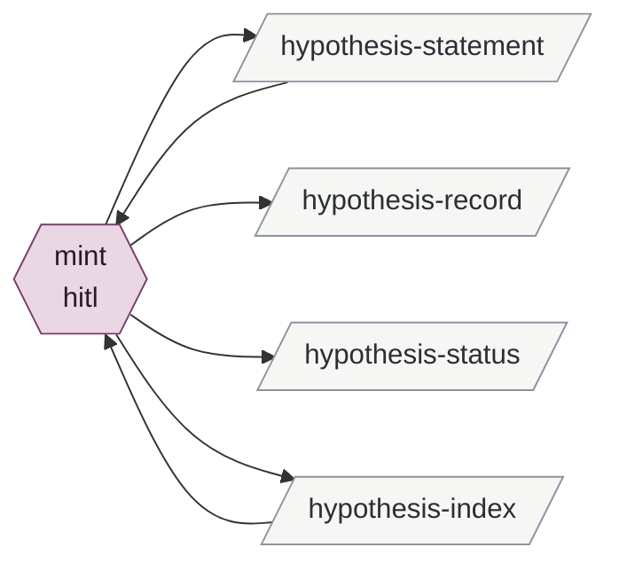

Derived from the tables, never authored:

- **inputs**: —
- **outputs**: hypothesis-index hypothesis-record hypothesis-statement hypothesis-status
- **instruments**: git
- **enabled by**: —
- **enables**: reviewing-leads

### refereeing-a-candidate

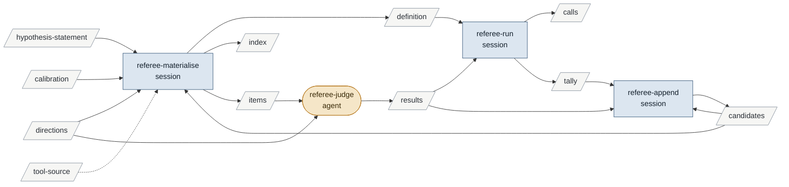

Derived from the tables, never authored:

- **inputs**: calibration directions hypothesis-statement tool-source
- **outputs**: calls candidates definition index items results tally
- **instruments**: runner tool-source
- **enabled by**: iterating-a-statement writing-candidates-from-verification preparing-to-verify-a-corpus
- **enables**: promoting-checked-candidates

### writing-candidates-from-verification

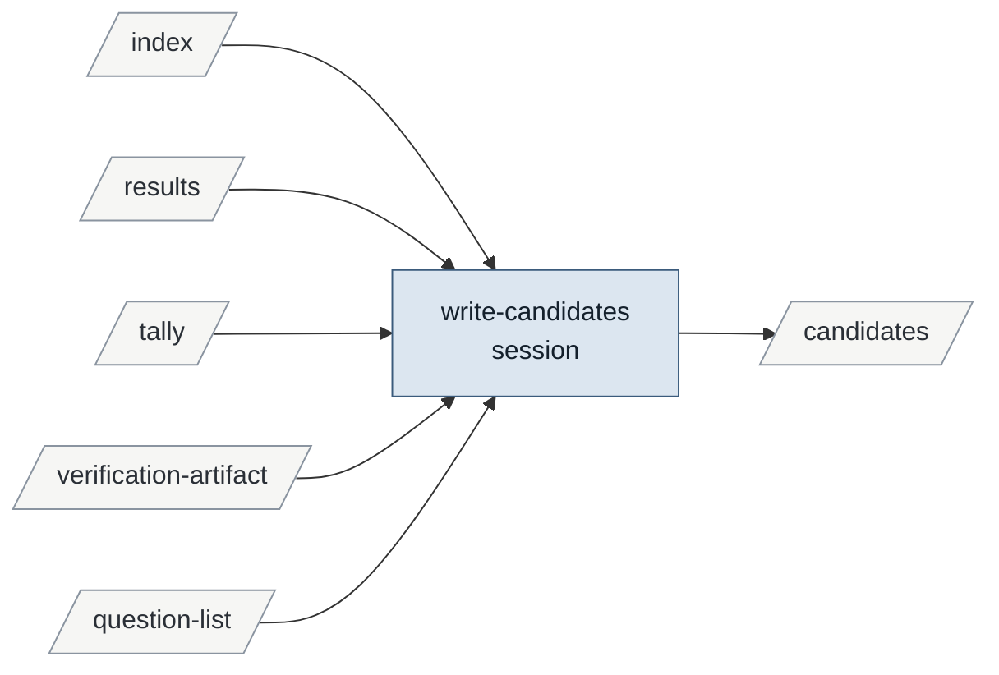

Derived from the tables, never authored:

- **inputs**: index question-list results tally verification-artifact
- **outputs**: candidates
- **instruments**: —
- **enabled by**: verifying-a-corpus
- **enables**: refereeing-a-candidate

### verifying-a-corpus

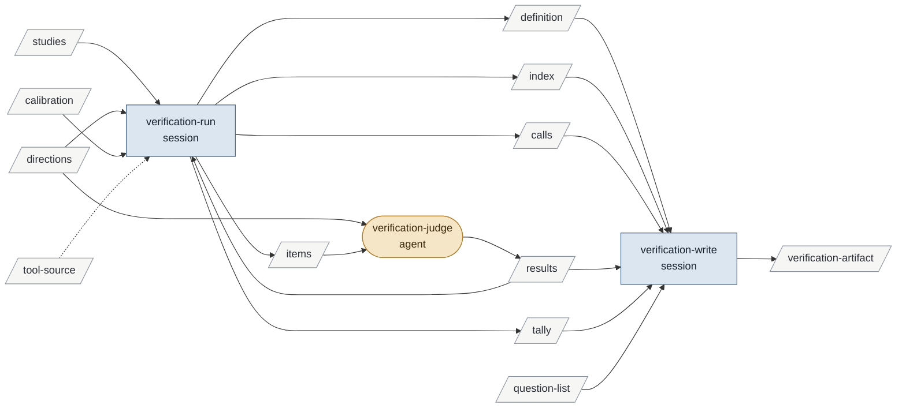

Derived from the tables, never authored:

- **inputs**: calibration directions question-list studies tool-source
- **outputs**: calls definition index items results tally verification-artifact
- **instruments**: runner tool-source
- **enabled by**: preparing-to-verify-a-corpus
- **enables**: writing-candidates-from-verification

### preparing-to-verify-a-corpus

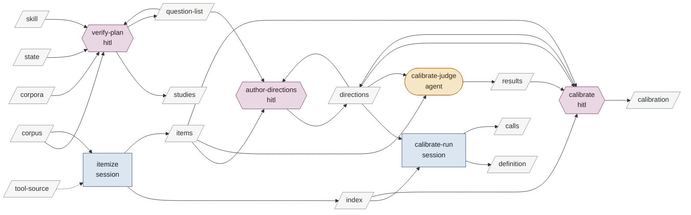

Derived from the tables, never authored:

- **inputs**: corpora corpus skill state tool-source
- **outputs**: calibration calls definition directions index items question-list results studies
- **instruments**: dotnet runner tool-source
- **enabled by**: reviewing-leads building-a-tool revising-the-method
- **enables**: verifying-a-corpus refereeing-a-candidate

### reviewing-leads

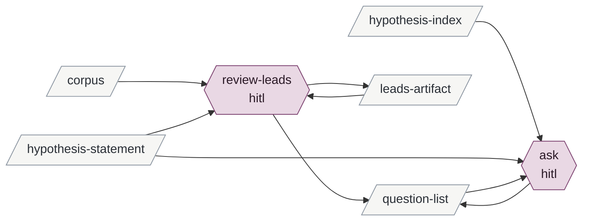

Derived from the tables, never authored:

- **inputs**: corpus hypothesis-index hypothesis-statement
- **outputs**: leads-artifact question-list
- **instruments**: git
- **enabled by**: minting-a-hypothesis exploring-a-corpus
- **enables**: preparing-to-verify-a-corpus

### exploring-a-corpus

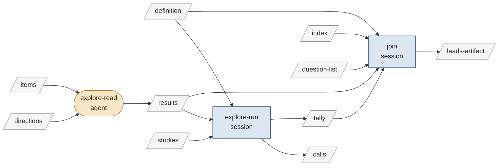

Derived from the tables, never authored:

- **inputs**: definition directions index items question-list studies
- **outputs**: calls leads-artifact results tally
- **instruments**: runner
- **enabled by**: preparing-to-explore-a-corpus
- **enables**: reviewing-leads

### preparing-to-explore-a-corpus

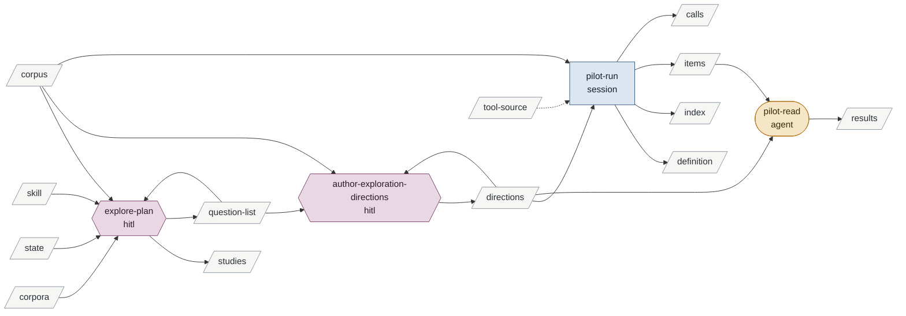

Derived from the tables, never authored:

- **inputs**: corpora corpus skill state tool-source
- **outputs**: calls definition directions index items question-list results studies
- **instruments**: runner tool-source
- **enabled by**: building-a-tool revising-the-method
- **enables**: exploring-a-corpus

### building-a-tool

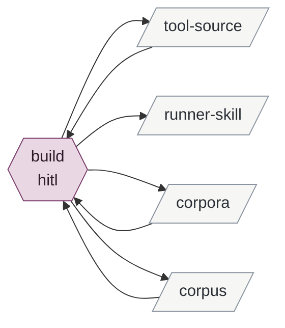

Derived from the tables, never authored:

- **inputs**: —
- **outputs**: corpora corpus runner-skill tool-source
- **instruments**: dotnet git
- **enabled by**: —
- **enables**: preparing-to-explore-a-corpus preparing-to-verify-a-corpus

### revising-the-method

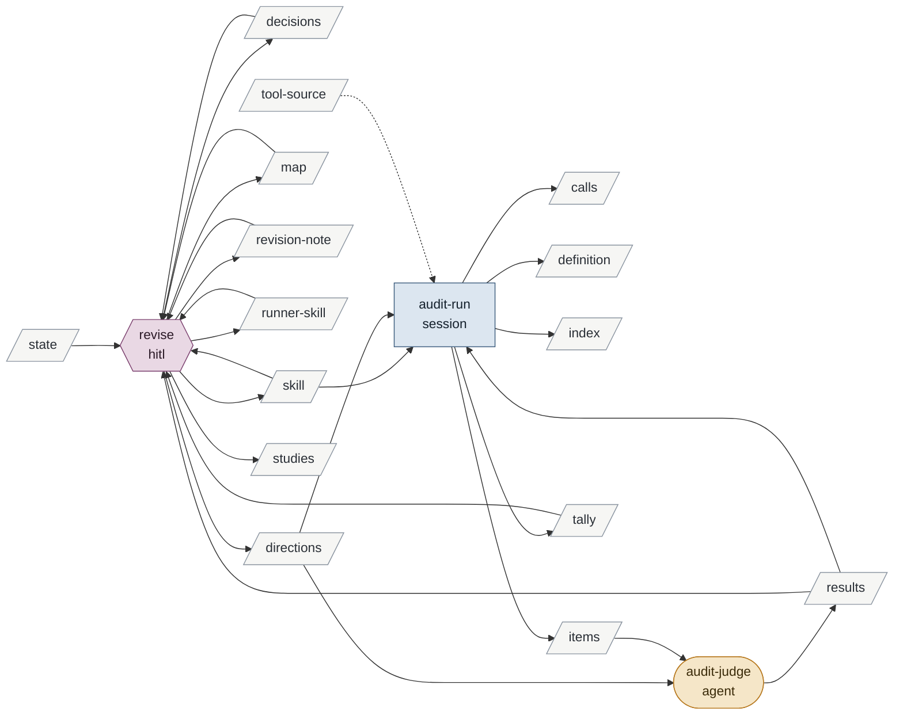

Derived from the tables, never authored:

- **inputs**: state tool-source
- **outputs**: calls decisions definition directions index items map results revision-note runner-skill skill studies tally
- **instruments**: DocIntegrity git runner tool-source
- **enabled by**: —
- **enables**: preparing-to-explore-a-corpus preparing-to-verify-a-corpus

## The whole graph

```mermaid
flowchart TD
  classDef hitl fill:#e9d8e4,stroke:#7a3e6d,color:#2b1a27
  classDef session fill:#dce6f0,stroke:#3b5b7c,color:#14202c
  classDef agent fill:#f5e6c8,stroke:#b7791f,color:#3a2a08
  classDef artifact fill:#f6f6f4,stroke:#8a94a0,color:#2a2f36
  classDef activity fill:#dcebdd,stroke:#4b7f52,color:#122816
  classDef terminus fill:#e4e4ea,stroke:#5b5b7a,color:#1c1c2c
  subgraph baseliningahypothesis["baselining-a-hypothesis"]
    baseline{{"baseline<br/>hitl"}}:::hitl
  end
  subgraph promotingcheckedcandidates["promoting-checked-candidates"]
    promote{{"promote<br/>hitl"}}:::hitl
  end
  subgraph iteratingastatement["iterating-a-statement"]
    iterate{{"iterate<br/>hitl"}}:::hitl
  end
  subgraph mintingahypothesis["minting-a-hypothesis"]
    mint{{"mint<br/>hitl"}}:::hitl
  end
  subgraph refereeingacandidate["refereeing-a-candidate"]
    refereematerialise["referee-materialise<br/>session"]:::session
    refereerun["referee-run<br/>session"]:::session
    refereejudge(["referee-judge<br/>agent"]):::agent
    refereeappend["referee-append<br/>session"]:::session
  end
  subgraph writingcandidatesfromverification["writing-candidates-from-verification"]
    writecandidates["write-candidates<br/>session"]:::session
  end
  subgraph verifyingacorpus["verifying-a-corpus"]
    verificationrun["verification-run<br/>session"]:::session
    verificationjudge(["verification-judge<br/>agent"]):::agent
    verificationwrite["verification-write<br/>session"]:::session
  end
  subgraph preparingtoverifyacorpus["preparing-to-verify-a-corpus"]
    verifyplan{{"verify-plan<br/>hitl"}}:::hitl
    itemize["itemize<br/>session"]:::session
    authordirections{{"author-directions<br/>hitl"}}:::hitl
    calibraterun["calibrate-run<br/>session"]:::session
    calibratejudge(["calibrate-judge<br/>agent"]):::agent
    calibrate{{"calibrate<br/>hitl"}}:::hitl
  end
  subgraph reviewingleads["reviewing-leads"]
    reviewleads{{"review-leads<br/>hitl"}}:::hitl
    ask{{"ask<br/>hitl"}}:::hitl
  end
  subgraph exploringacorpus["exploring-a-corpus"]
    explorerun["explore-run<br/>session"]:::session
    exploreread(["explore-read<br/>agent"]):::agent
    join["join<br/>session"]:::session
  end
  subgraph preparingtoexploreacorpus["preparing-to-explore-a-corpus"]
    exploreplan{{"explore-plan<br/>hitl"}}:::hitl
    authorexplorationdirections{{"author-exploration-directions<br/>hitl"}}:::hitl
    pilotrun["pilot-run<br/>session"]:::session
    pilotread(["pilot-read<br/>agent"]):::agent
  end
  subgraph buildingatool["building-a-tool"]
    build{{"build<br/>hitl"}}:::hitl
  end
  subgraph revisingthemethod["revising-the-method"]
    revise{{"revise<br/>hitl"}}:::hitl
    auditrun["audit-run<br/>session"]:::session
    auditjudge(["audit-judge<br/>agent"]):::agent
  end
  hypothesisstatement[/"hypothesis-statement"/]:::artifact
  hypothesisrecord[/"hypothesis-record"/]:::artifact
  hypothesisstatus[/"hypothesis-status"/]:::artifact
  hypothesisindex[/"hypothesis-index"/]:::artifact
  questionlist[/"question-list"/]:::artifact
  studies[/"studies"/]:::artifact
  state[/"state"/]:::artifact
  revisionnote[/"revision-note"/]:::artifact
  decisions[/"decisions"/]:::artifact
  leadsartifact[/"leads-artifact"/]:::artifact
  verificationartifact[/"verification-artifact"/]:::artifact
  candidates[/"candidates"/]:::artifact
  corpora[/"corpora"/]:::artifact
  directions[/"directions"/]:::artifact
  calibration[/"calibration"/]:::artifact
  definition[/"definition"/]:::artifact
  index[/"index"/]:::artifact
  items[/"items"/]:::artifact
  calls[/"calls"/]:::artifact
  results[/"results"/]:::artifact
  tally[/"tally"/]:::artifact
  skill[/"skill"/]:::artifact
  runnerskill[/"runner-skill"/]:::artifact
  map[/"map"/]:::artifact
  toolsource[/"tool-source"/]:::artifact
  corpus[/"corpus"/]:::artifact

  hypothesisstatement --> baseline
  hypothesisrecord --> baseline
  hypothesisstatus --> baseline
  baseline --> hypothesisrecord
  baseline --> hypothesisstatus
  baseline --> questionlist
  candidates --> promote
  index --> promote
  corpus --> promote
  hypothesisstatement --> promote
  hypothesisrecord --> promote
  promote --> hypothesisrecord
  promote --> hypothesisstatus
  promote --> candidates
  promote --> questionlist
  promote --> verificationartifact
  hypothesisstatement --> iterate
  hypothesisrecord --> iterate
  iterate --> hypothesisstatement
  iterate --> hypothesisrecord
  iterate --> hypothesisstatus
  iterate --> candidates
  hypothesisindex --> mint
  hypothesisstatement --> mint
  mint --> hypothesisstatement
  mint --> hypothesisrecord
  mint --> hypothesisstatus
  mint --> hypothesisindex
  hypothesisstatement --> refereematerialise
  candidates --> refereematerialise
  directions --> refereematerialise
  calibration --> refereematerialise
  toolsource -.-> refereematerialise
  refereematerialise --> definition
  refereematerialise --> index
  refereematerialise --> items
  definition --> refereerun
  results --> refereerun
  refereerun --> calls
  refereerun --> tally
  directions --> refereejudge
  items --> refereejudge
  refereejudge --> results
  results --> refereeappend
  tally --> refereeappend
  candidates --> refereeappend
  refereeappend --> candidates
  index --> writecandidates
  results --> writecandidates
  tally --> writecandidates
  verificationartifact --> writecandidates
  questionlist --> writecandidates
  writecandidates --> candidates
  studies --> verificationrun
  directions --> verificationrun
  calibration --> verificationrun
  results --> verificationrun
  toolsource -.-> verificationrun
  verificationrun --> definition
  verificationrun --> index
  verificationrun --> items
  verificationrun --> calls
  verificationrun --> tally
  directions --> verificationjudge
  items --> verificationjudge
  verificationjudge --> results
  definition --> verificationwrite
  index --> verificationwrite
  calls --> verificationwrite
  results --> verificationwrite
  tally --> verificationwrite
  questionlist --> verificationwrite
  verificationwrite --> verificationartifact
  questionlist --> verifyplan
  corpora --> verifyplan
  corpus --> verifyplan
  state --> verifyplan
  skill --> verifyplan
  verifyplan --> studies
  verifyplan --> questionlist
  corpus --> itemize
  toolsource -.-> itemize
  itemize --> index
  itemize --> items
  questionlist --> authordirections
  items --> authordirections
  directions --> authordirections
  authordirections --> directions
  directions --> calibraterun
  index --> calibraterun
  calibraterun --> definition
  calibraterun --> calls
  directions --> calibratejudge
  items --> calibratejudge
  calibratejudge --> results
  index --> calibrate
  items --> calibrate
  results --> calibrate
  directions --> calibrate
  calibrate --> calibration
  calibrate --> directions
  leadsartifact --> reviewleads
  corpus --> reviewleads
  hypothesisstatement --> reviewleads
  reviewleads --> leadsartifact
  reviewleads --> questionlist
  hypothesisindex --> ask
  hypothesisstatement --> ask
  questionlist --> ask
  ask --> questionlist
  studies --> explorerun
  definition --> explorerun
  results --> explorerun
  explorerun --> calls
  explorerun --> tally
  directions --> exploreread
  items --> exploreread
  exploreread --> results
  definition --> join
  index --> join
  results --> join
  tally --> join
  questionlist --> join
  join --> leadsartifact
  questionlist --> exploreplan
  corpora --> exploreplan
  corpus --> exploreplan
  state --> exploreplan
  skill --> exploreplan
  exploreplan --> studies
  exploreplan --> questionlist
  questionlist --> authorexplorationdirections
  corpus --> authorexplorationdirections
  directions --> authorexplorationdirections
  authorexplorationdirections --> directions
  directions --> pilotrun
  corpus --> pilotrun
  toolsource -.-> pilotrun
  pilotrun --> definition
  pilotrun --> index
  pilotrun --> items
  pilotrun --> calls
  directions --> pilotread
  items --> pilotread
  pilotread --> results
  corpora --> build
  toolsource --> build
  corpus --> build
  build --> toolsource
  build --> runnerskill
  build --> corpora
  build --> corpus
  skill --> revise
  runnerskill --> revise
  map --> revise
  state --> revise
  revisionnote --> revise
  decisions --> revise
  results --> revise
  tally --> revise
  revise --> skill
  revise --> runnerskill
  revise --> decisions
  revise --> revisionnote
  revise --> map
  revise --> studies
  revise --> directions
  skill --> auditrun
  directions --> auditrun
  results --> auditrun
  toolsource -.-> auditrun
  auditrun --> definition
  auditrun --> index
  auditrun --> items
  auditrun --> calls
  auditrun --> tally
  directions --> auditjudge
  items --> auditjudge
  auditjudge --> results
```

## Consumers

| artifact | written by | read by | instrument of |
|---|---|---|---|
| hypothesis-statement | iterate mint | baseline promote iterate mint referee-materialise review-leads ask | — |
| hypothesis-record | baseline promote iterate mint | baseline promote iterate | — |
| hypothesis-status | baseline promote iterate mint | baseline | — |
| hypothesis-index | mint | mint ask | — |
| question-list | baseline promote verify-plan review-leads ask explore-plan | write-candidates verification-write verify-plan author-directions ask join explore-plan author-exploration-directions | — |
| studies | verify-plan explore-plan revise | verification-run explore-run | — |
| state | — | verify-plan explore-plan revise | — |
| revision-note | revise | revise | — |
| decisions | revise | revise | — |
| leads-artifact | review-leads join | review-leads | — |
| verification-artifact | promote verification-write | write-candidates | — |
| candidates | promote iterate referee-append write-candidates | promote referee-materialise referee-append | — |
| corpora | build | verify-plan explore-plan build | — |
| directions | author-directions calibrate author-exploration-directions revise | referee-materialise referee-judge verification-run verification-judge author-directions calibrate-run calibrate-judge calibrate explore-read author-exploration-directions pilot-run pilot-read audit-run audit-judge | — |
| calibration | calibrate | referee-materialise verification-run | — |
| definition | referee-materialise verification-run calibrate-run pilot-run audit-run | referee-run verification-write explore-run join | — |
| index | referee-materialise verification-run itemize pilot-run audit-run | promote write-candidates verification-write calibrate-run calibrate join | — |
| items | referee-materialise verification-run itemize pilot-run audit-run | referee-judge verification-judge author-directions calibrate-judge calibrate explore-read pilot-read audit-judge | — |
| calls | referee-run verification-run calibrate-run explore-run pilot-run audit-run | verification-write | — |
| results | referee-judge verification-judge calibrate-judge explore-read pilot-read audit-judge | referee-run referee-append write-candidates verification-run verification-write calibrate explore-run join revise audit-run | — |
| tally | referee-run verification-run explore-run audit-run | referee-append write-candidates verification-write join revise | — |
| skill | revise | verify-plan explore-plan revise audit-run | — |
| runner-skill | build revise | revise | — |
| map | revise | revise | — |
| tool-source | build | build | referee-materialise verification-run itemize pilot-run audit-run |
| corpus | build | promote verify-plan itemize review-leads explore-plan author-exploration-directions pilot-run build | — |

## Validation

Last run: **passed** (3 note(s)).

| level | check | row | message |
|---|---|---|---|
| vacuous | enables.vacuous | — | edges into the terminus are not checked for data flow, since it owns no processes: baselining-a-hypothesis → changing-the-planner-for-v3 |
| info | info.artifact.never-written | state | read by verify-plan, explore-plan, revise and written by no process; informational (generated by a tool, or authored outside the method) |
| info | info.instrument.free-name | instruments | instrument names that are not artifact ids: DocIntegrity, dotnet, git, runner. A program whose code is an artifact is named by its id; check none of these should have been |
