# map.md — generated by tools/StoryPlanner.ProcessMap

Never hand-edited: `render` rewrites this file whole from the tables in SKILL.md, the activity files and artifacts.md. Nothing here is authored.

<!-- generated:graph -->
## The whole graph

```mermaid
flowchart TD
  classDef hitl fill:#e9d8e4,stroke:#7a3e6d,color:#2b1a27
  classDef session fill:#dce6f0,stroke:#3b5b7c,color:#14202c
  classDef agent fill:#f5e6c8,stroke:#b7791f,color:#3a2a08
  classDef artifact fill:#f6f6f4,stroke:#8a94a0,color:#2a2f36
  classDef activity fill:#dcebdd,stroke:#4b7f52,color:#122816
  classDef terminus fill:#e4e4ea,stroke:#5b5b7a,color:#1c1c2c
  subgraph baseliningahypothesis["baselining-a-hypothesis"]
    baseline{{"baseline<br/>hitl"}}:::hitl
  end
  subgraph promotingcheckedcandidates["promoting-checked-candidates"]
    promote{{"promote<br/>hitl"}}:::hitl
  end
  subgraph iteratingastatement["iterating-a-statement"]
    iterate{{"iterate<br/>hitl"}}:::hitl
  end
  subgraph mintingahypothesis["minting-a-hypothesis"]
    mint{{"mint<br/>hitl"}}:::hitl
  end
  subgraph refereeingacandidate["refereeing-a-candidate"]
    refereematerialise["referee-materialise<br/>session"]:::session
    refereerun["referee-run<br/>session"]:::session
    refereejudge(["referee-judge<br/>agent"]):::agent
    refereeappend["referee-append<br/>session"]:::session
  end
  subgraph writingcandidatesfromverification["writing-candidates-from-verification"]
    writecandidates["write-candidates<br/>session"]:::session
  end
  subgraph conductingaverificationround["conducting-a-verification-round"]
    roundrun["round-run<br/>session"]:::session
    roundjudge(["round-judge<br/>agent"]):::agent
    roundwrite["round-write<br/>session"]:::session
  end
  subgraph preparingtoverifyacorpus["preparing-to-verify-a-corpus"]
    verifyplan{{"verify-plan<br/>hitl"}}:::hitl
    itemize["itemize<br/>session"]:::session
    authorcodebook{{"author-codebook<br/>hitl"}}:::hitl
    calibraterun["calibrate-run<br/>session"]:::session
    calibratejudge(["calibrate-judge<br/>agent"]):::agent
    calibrate{{"calibrate<br/>hitl"}}:::hitl
  end
  subgraph reviewingleads["reviewing-leads"]
    reviewleads{{"review-leads<br/>hitl"}}:::hitl
    ask{{"ask<br/>hitl"}}:::hitl
  end
  subgraph exploringacorpus["exploring-a-corpus"]
    pathfind["pathfind<br/>session"]:::session
    slicerun["slice-run<br/>session"]:::session
    sliceread(["slice-read<br/>agent"]):::agent
    joinandbin["join-and-bin<br/>session"]:::session
  end
  subgraph preparingtoexploreacorpus["preparing-to-explore-a-corpus"]
    exploreplan{{"explore-plan<br/>hitl"}}:::hitl
    slice["slice<br/>session"]:::session
    authorprotocol{{"author-protocol<br/>hitl"}}:::hitl
    pilotrun{{"pilot-run<br/>hitl"}}:::hitl
    pilotread(["pilot-read<br/>agent"]):::agent
  end
  subgraph buildingatool["building-a-tool"]
    build{{"build<br/>hitl"}}:::hitl
  end
  subgraph revisingthemethod["revising-the-method"]
    revise{{"revise<br/>hitl"}}:::hitl
    auditrun["audit-run<br/>session"]:::session
    auditjudge(["audit-judge<br/>agent"]):::agent
  end
  hypothesisstatement[/"hypothesis-statement"/]:::artifact
  hypothesisrecord[/"hypothesis-record"/]:::artifact
  hypothesisstatus[/"hypothesis-status"/]:::artifact
  hypothesisindex[/"hypothesis-index"/]:::artifact
  questionlist[/"question-list"/]:::artifact
  instances[/"instances"/]:::artifact
  state[/"state"/]:::artifact
  revisionnote[/"revision-note"/]:::artifact
  rulingslog[/"rulings-log"/]:::artifact
  leadsartifact[/"leads-artifact"/]:::artifact
  verificationartifact[/"verification-artifact"/]:::artifact
  armkey[/"arm-key"/]:::artifact
  candidates[/"candidates"/]:::artifact
  iterationcandidates[/"iteration-candidates"/]:::artifact
  corpusstatus[/"corpus-status"/]:::artifact
  codebook[/"codebook"/]:::artifact
  readingprotocol[/"reading-protocol"/]:::artifact
  calibrationrecord[/"calibration-record"/]:::artifact
  itemizer[/"itemizer"/]:::artifact
  generator[/"generator"/]:::artifact
  tallier[/"tallier"/]:::artifact
  items[/"items"/]:::artifact
  itemsmanifest[/"items-manifest"/]:::artifact
  jobs[/"jobs"/]:::artifact
  ledger[/"ledger"/]:::artifact
  results[/"results"/]:::artifact
  tallyoutput[/"tally-output"/]:::artifact
  runrecord[/"run-record"/]:::artifact
  skill[/"skill"/]:::artifact
  runnerskill[/"runner-skill"/]:::artifact
  map[/"map"/]:::artifact
  auditprotocol[/"audit-protocol"/]:::artifact
  toolsource[/"tool-source"/]:::artifact
  corpus[/"corpus"/]:::artifact

  hypothesisstatement --> baseline
  hypothesisrecord --> baseline
  hypothesisstatus --> baseline
  baseline --> hypothesisrecord
  baseline --> hypothesisstatus
  baseline --> questionlist
  candidates --> promote
  iterationcandidates --> promote
  corpus --> promote
  hypothesisstatement --> promote
  hypothesisrecord --> promote
  promote --> hypothesisrecord
  promote --> hypothesisstatus
  promote --> candidates
  promote --> iterationcandidates
  promote --> questionlist
  promote --> verificationartifact
  hypothesisstatement --> iterate
  hypothesisrecord --> iterate
  iterate --> hypothesisstatement
  iterate --> hypothesisrecord
  iterate --> hypothesisstatus
  iterate --> iterationcandidates
  hypothesisindex --> mint
  hypothesisstatement --> mint
  mint --> hypothesisstatement
  mint --> hypothesisrecord
  mint --> hypothesisstatus
  mint --> hypothesisindex
  hypothesisstatement --> refereematerialise
  candidates --> refereematerialise
  iterationcandidates --> refereematerialise
  codebook --> refereematerialise
  itemizer -.-> refereematerialise
  generator -.-> refereematerialise
  refereematerialise --> items
  refereematerialise --> itemsmanifest
  refereematerialise --> jobs
  jobs --> refereerun
  codebook --> refereerun
  calibrationrecord --> refereerun
  items --> refereerun
  results --> refereerun
  tallier -.-> refereerun
  refereerun --> ledger
  refereerun --> tallyoutput
  refereerun --> runrecord
  codebook --> refereejudge
  items --> refereejudge
  refereejudge --> results
  results --> refereeappend
  tallyoutput --> refereeappend
  candidates --> refereeappend
  iterationcandidates --> refereeappend
  refereeappend --> candidates
  refereeappend --> iterationcandidates
  results --> writecandidates
  tallyoutput --> writecandidates
  verificationartifact --> writecandidates
  questionlist --> writecandidates
  writecandidates --> candidates
  instances --> roundrun
  items --> roundrun
  itemsmanifest --> roundrun
  codebook --> roundrun
  calibrationrecord --> roundrun
  results --> roundrun
  generator -.-> roundrun
  tallier -.-> roundrun
  roundrun --> jobs
  roundrun --> ledger
  roundrun --> tallyoutput
  roundrun --> runrecord
  codebook --> roundjudge
  items --> roundjudge
  roundjudge --> results
  results --> roundwrite
  tallyoutput --> roundwrite
  ledger --> roundwrite
  runrecord --> roundwrite
  questionlist --> roundwrite
  roundwrite --> verificationartifact
  questionlist --> verifyplan
  corpusstatus --> verifyplan
  corpus --> verifyplan
  state --> verifyplan
  skill --> verifyplan
  verifyplan --> instances
  verifyplan --> questionlist
  corpus --> itemize
  itemizer --> itemize
  itemizer -.-> itemize
  itemize --> itemizer
  itemize --> toolsource
  itemize --> items
  itemize --> itemsmanifest
  questionlist --> authorcodebook
  items --> authorcodebook
  codebook --> authorcodebook
  authorcodebook --> codebook
  authorcodebook --> generator
  authorcodebook --> tallier
  codebook --> calibraterun
  items --> calibraterun
  generator -.-> calibraterun
  calibraterun --> jobs
  calibraterun --> ledger
  calibraterun --> runrecord
  codebook --> calibratejudge
  items --> calibratejudge
  calibratejudge --> results
  items --> calibrate
  results --> calibrate
  codebook --> calibrate
  calibrate --> calibrationrecord
  calibrate --> codebook
  leadsartifact --> reviewleads
  armkey --> reviewleads
  corpus --> reviewleads
  hypothesisstatement --> reviewleads
  reviewleads --> leadsartifact
  reviewleads --> questionlist
  hypothesisindex --> ask
  hypothesisstatement --> ask
  questionlist --> ask
  ask --> questionlist
  corpus --> pathfind
  questionlist --> pathfind
  pathfind --> leadsartifact
  instances --> slicerun
  items --> slicerun
  itemsmanifest --> slicerun
  readingprotocol --> slicerun
  generator -.-> slicerun
  slicerun --> jobs
  slicerun --> ledger
  slicerun --> runrecord
  readingprotocol --> sliceread
  items --> sliceread
  sliceread --> results
  results --> joinandbin
  runrecord --> joinandbin
  questionlist --> joinandbin
  joinandbin --> leadsartifact
  questionlist --> exploreplan
  corpusstatus --> exploreplan
  corpus --> exploreplan
  state --> exploreplan
  skill --> exploreplan
  exploreplan --> instances
  exploreplan --> armkey
  exploreplan --> questionlist
  corpus --> slice
  itemizer -.-> slice
  slice --> items
  slice --> itemsmanifest
  questionlist --> authorprotocol
  items --> authorprotocol
  readingprotocol --> authorprotocol
  authorprotocol --> readingprotocol
  authorprotocol --> generator
  readingprotocol --> pilotrun
  items --> pilotrun
  results --> pilotrun
  generator -.-> pilotrun
  pilotrun --> jobs
  pilotrun --> ledger
  pilotrun --> runrecord
  readingprotocol --> pilotread
  items --> pilotread
  pilotread --> results
  corpusstatus --> build
  toolsource --> build
  corpus --> build
  build --> toolsource
  build --> runnerskill
  build --> corpusstatus
  build --> corpus
  skill --> revise
  runnerskill --> revise
  map --> revise
  state --> revise
  revisionnote --> revise
  rulingslog --> revise
  results --> revise
  tallyoutput --> revise
  revise --> skill
  revise --> runnerskill
  revise --> rulingslog
  revise --> revisionnote
  revise --> map
  skill --> auditrun
  auditprotocol --> auditrun
  generator -.-> auditrun
  tallier -.-> auditrun
  auditrun --> items
  auditrun --> itemsmanifest
  auditrun --> jobs
  auditrun --> ledger
  auditrun --> runrecord
  auditrun --> tallyoutput
  auditprotocol --> auditjudge
  items --> auditjudge
  skill --> auditjudge
  auditjudge --> results
```

<!-- /generated -->

<!-- generated:consumers -->
## Consumers

| artifact | written by | read by | instrument of |
|---|---|---|---|
| hypothesis-statement | iterate mint | baseline promote iterate mint referee-materialise review-leads ask | — |
| hypothesis-record | baseline promote iterate mint | baseline promote iterate | — |
| hypothesis-status | baseline promote iterate mint | baseline | — |
| hypothesis-index | mint | mint ask | — |
| question-list | baseline promote verify-plan review-leads ask explore-plan | write-candidates round-write verify-plan author-codebook ask pathfind join-and-bin explore-plan author-protocol | — |
| instances | verify-plan explore-plan | round-run slice-run | — |
| state | — | verify-plan explore-plan revise | — |
| revision-note | revise | revise | — |
| rulings-log | revise | revise | — |
| leads-artifact | review-leads pathfind join-and-bin | review-leads | — |
| verification-artifact | promote round-write | write-candidates | — |
| arm-key | explore-plan | review-leads | — |
| candidates | promote referee-append write-candidates | promote referee-materialise referee-append | — |
| iteration-candidates | promote iterate referee-append | promote referee-materialise referee-append | — |
| corpus-status | build | verify-plan explore-plan build | — |
| codebook | author-codebook calibrate | referee-materialise referee-run referee-judge round-run round-judge author-codebook calibrate-run calibrate-judge calibrate | — |
| reading-protocol | author-protocol | slice-run slice-read author-protocol pilot-run pilot-read | — |
| calibration-record | calibrate | referee-run round-run | — |
| itemizer | itemize | itemize | referee-materialise itemize slice |
| generator | author-codebook author-protocol | — | referee-materialise round-run calibrate-run slice-run pilot-run audit-run |
| tallier | author-codebook | — | referee-run round-run audit-run |
| items | referee-materialise itemize slice audit-run | referee-run referee-judge round-run round-judge author-codebook calibrate-run calibrate-judge calibrate slice-run slice-read author-protocol pilot-run pilot-read audit-judge | — |
| items-manifest | referee-materialise itemize slice audit-run | round-run slice-run | — |
| jobs | referee-materialise round-run calibrate-run slice-run pilot-run audit-run | referee-run | — |
| ledger | referee-run round-run calibrate-run slice-run pilot-run audit-run | round-write | — |
| results | referee-judge round-judge calibrate-judge slice-read pilot-read audit-judge | referee-run referee-append write-candidates round-run round-write calibrate join-and-bin pilot-run revise | — |
| tally-output | referee-run round-run audit-run | referee-append write-candidates round-write revise | — |
| run-record | referee-run round-run calibrate-run slice-run pilot-run audit-run | round-write join-and-bin | — |
| skill | revise | verify-plan explore-plan revise audit-run audit-judge | — |
| runner-skill | build revise | revise | — |
| map | revise | revise | — |
| audit-protocol | — | audit-run audit-judge | — |
| tool-source | itemize build | build | — |
| corpus | build | promote verify-plan itemize review-leads pathfind explore-plan slice build | — |
<!-- /generated -->

<!-- generated:validation -->
## Validation

Last run: **passed** (4 note(s)).

| level | rule | row | message |
|---|---|---|---|
| vacuous | enables.vacuous | — | edges into the terminus are not checked for data flow, since it owns no processes: baselining-a-hypothesis → changing-the-planner-for-v3 |
| info | info.artifact.never-written | state | read by verify-plan, explore-plan, revise and written by no process; informational (generated by a tool, or authored outside the method) |
| info | info.artifact.never-written | audit-protocol | read by audit-run, audit-judge and written by no process; informational (generated by a tool, or authored outside the method) |
| info | info.instrument.free-name | instruments | instrument names that are not artifact ids: ProcessMap, dotnet, git, runner. A program whose code is an artifact is named by its id; check none of these should have been |
<!-- /generated -->
