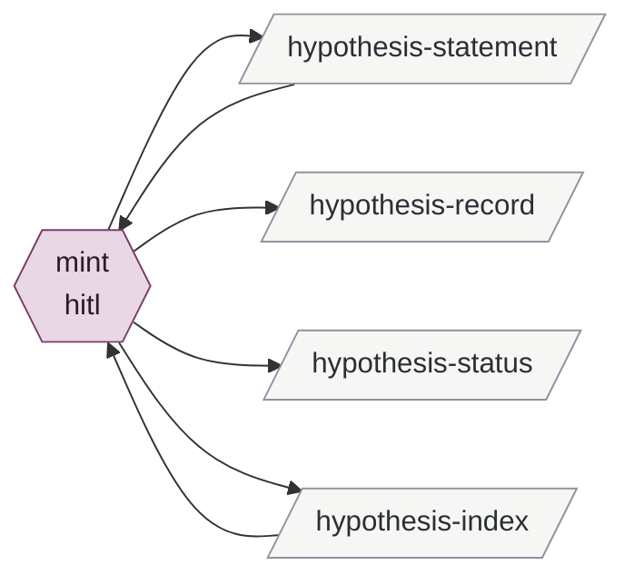

# minting-a-hypothesis

Enables reviewing-leads.

| id | mode | instruments | reads | writes | state | description |
|---|---|---|---|---|---|---|
| mint | hitl | git | hypothesis-index hypothesis-statement | hypothesis-statement hypothesis-record hypothesis-status hypothesis-index | built | A new hypothesis file on novelty, testability and independence against the current set; Brian words or approves the statement; the created entry records what prompted it |

<!-- generated:activity -->

Derived from the tables, never authored:

- **inputs**: —
- **outputs**: hypothesis-index hypothesis-record hypothesis-statement hypothesis-status
- **instruments**: git
- **enabled by**: —
- **enables**: reviewing-leads
<!-- /generated -->

## Preconditions

Something prompted it: Brian's own statement, a lead, evidence in a record, or a merge or
split. Three criteria hold, all required: novelty (it is not evidence for an existing
hypothesis), testability (evidence could confirm or refute it), independence (it is not a
refinement, which would be an iteration).

## mint

Brian's explicit statements always get the offer. A session's own reading may surface a
proposal only when the three criteria hold, and the proposal cites the specific lead,
entry or statement that prompted it, never a synthesis. During an exploration's or a
round's autonomous part the proposal is held for the review or the promotion session.

Brian reviews the statement: rewrites it in his words, or approves. The session mints the
file with the next unused id, `status: untested`, `baselined: false`, `created` today, and
a `created` entry recording the provenance ("originated from <the lead or statement>;
Brian endorsed on <date>" or "Brian's statement of <date>"); adds the row to the index;
one commit. For a merge or split, the `created` entry names the files it came from.

The trap this guards: a proposal in Claude's framing, nodded through, on which later
sessions build. Provenance in the `created` entry is what lets a future session tell
Brian-originated from Claude-originated.

## Never

Mints without Brian's rewrite or approval; reuses an id; writes a statement that carries
provenance, implications or testing method; mints a refinement.
