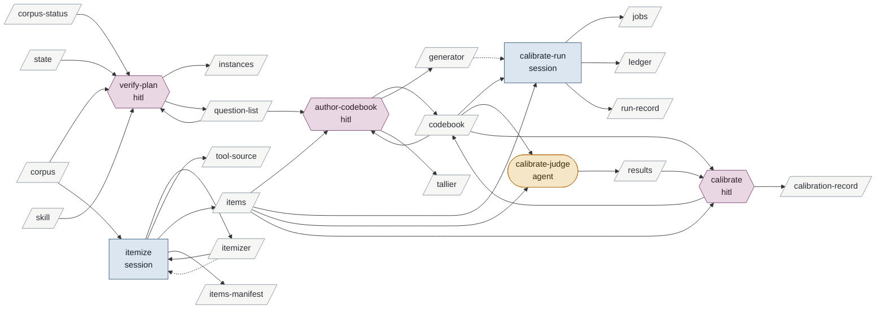

# preparing-to-verify-a-corpus

Enables conducting-a-verification-round and refereeing-a-candidate.

| id | mode | instruments | reads | writes | state | description |
|---|---|---|---|---|---|---|
| verify-plan | hitl | | question-list corpus-status corpus state skill | instances question-list | specified | Brian and the session fix what one item is and which questions the codebook will freeze; the plan approved is his go, and the instance is registered; for a repeat round under an unchanged instrument this is the whole activity |
| itemize | session | itemizer dotnet | corpus itemizer | itemizer tool-source items items-manifest | specified | Build or pick the itemizer with tests, run it once; the items and their manifest |
| author-codebook | hitl | | question-list items codebook | codebook generator tallier | specified | Write the codebook against real items: item definition, classes, decision rules; the generator and tallier that encode its output contract; a new numbered version each time |
| calibrate-run | session | generator runner | codebook items | jobs ledger run-record | specified | The sample, one job per item under the draft version's hash; the host's batch; this is the codebook's pilot |
| calibrate-judge | agent | | codebook items | results | specified | A classifier applies the draft codebook to one sample item; the only writer of the sample's results |
| calibrate | hitl | | items results codebook | calibration-record codebook | specified | Brian scores the sample blind; the two scorings are compared; he rules each disagreement; rulings edit the codebook into a new version; the record is written |

<!-- generated:activity -->

Derived from the tables, never authored:

- **inputs**: corpus corpus-status skill state
- **outputs**: calibration-record codebook generator instances itemizer items items-manifest jobs ledger question-list results run-record tallier tool-source
- **instruments**: dotnet generator itemizer runner
- **enabled by**: reviewing-leads building-a-tool revising-the-method
- **enables**: conducting-a-verification-round refereeing-a-candidate
<!-- /generated -->

## Preconditions

The corpus is readable and CORPUS-STATUS says so. Its question list holds open questions
whose answers a frozen predicate could give. For the referee, the instance is `referee-<n>`,
the corpus is `candidates`, the itemizer is the materialise step that refereeing-a-candidate
reuses per run, the question is the pipeline's own (does this finding discriminate for this
statement?), and the activity stops after `calibrate`: there is no round of its own.

## verify-plan

The session presents the open questions and the corpus's shape as CORPUS-STATUS records
it, and asks Brian, batched four per call, what one item is for this corpus, which
questions this codebook will freeze, and what the calibration sample should span. It
writes the plan naming those, the itemizer to build or reuse, and what the round will not
do; the plan is written against the chain's activity files, from
conducting-a-verification-round to promoting-checked-candidates, read whole here rather
than each at its own start, since it names what each of them will do for this instance.
Brian approves. The session appends the instance to `instances.md` with the date as
his go, and writes any question he raised here into the list.

For a repeat round under an unchanged instrument — the codebook's current version has a
calibration record and covers every question the round is to answer, and the items are
current — this is the whole activity: the go is registered and conducting-a-verification-round
follows. Anything the instrument does not cover runs the rest.

## itemize

The itemizer is code with tests under the `testing` skill, or the runner's split verb where
a corpus is already markdown units. Built or picked, it runs once and writes
`fanout/<instance>/<run>/items/` and the manifest. The item definition it implements is
the one the codebook's `## Item` section will state, so the two are written together. An
itemizer never selects by judgment; an authored query in Brian's vocabulary is the only
narrowing it may do, and the query is recorded in the manifest.

## author-codebook

Written against the real items, in the format `artifacts.md` § Codebook: what one item is,
the inputs by reference to the agent row, the output contract, the classes, the decision
rules at the boundaries, tuned to over-flag. A new numbered file; the previous version, if
any, stays on disk. With it, the generator that writes one job per item with the output
contract's markers, and the tallier that reduces results by its classes.

## calibrate-run

A sample of the items, drawn as the plan said, stratified by expected class, with a
held-out split named in advance. One job per sample item under the draft version's hash,
through the runner per the `agent-runner` skill; this is the codebook's pilot. The results
are withheld from Brian until he has scored.

## calibrate-judge

Instructed by the draft codebook and nothing else; one sample item in, one label out, in
the output contract's form.

## calibrate

Brian scores each sample item blind, in whatever order the session presents them, and the
session writes his verdicts as given. Then the two scorings are laid side by side: per
class agreement on the ruled items and on the held-out items separately. For each
disagreement Brian rules; a ruling that changes a rule edits the codebook into a new
version, and the ruled item becomes an anchor under that rule. The session writes the
calibration record. If any ruling changed the rules, calibrate-run repeats on the sample
under the new version; when Brian accepts the agreement, the record's verdict says so. The
corpus is then instrumented at that hash; nothing in the codebook records it, since any
line in the file is part of the hash.

## Never

Runs a batch under a version with no calibration record; shows Brian the agent's scores
before his own are written; lets the itemizer narrow by judgment; authors a codebook
without items in front of it; writes a candidate.
