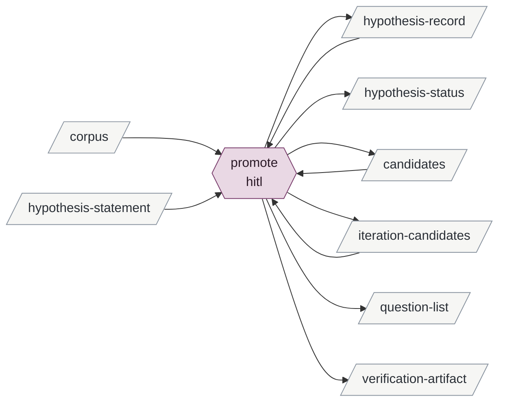

# promoting-checked-candidates

Enables baselining-a-hypothesis.

| id | mode | instruments | reads | writes | state | description |
|---|---|---|---|---|---|---|
| promote | hitl | git | candidates iteration-candidates corpus hypothesis-statement hypothesis-record | hypothesis-record hypothesis-status candidates iteration-candidates question-list verification-artifact | specified | Brian decides the pending diagnostic candidates he chooses, by hypothesis or by round, each after its source is read; entries and outcomes written; status recomputed; one commit |

<!-- generated:activity -->

Derived from the tables, never authored:

- **inputs**: corpus hypothesis-statement
- **outputs**: candidates hypothesis-record hypothesis-status iteration-candidates question-list verification-artifact
- **instruments**: git
- **enabled by**: refereeing-a-candidate
- **enables**: baselining-a-hypothesis
<!-- /generated -->

## Preconditions

Every candidate in scope carries the referee's `falsifier` and `referee` lines under a
codebook hash that has a calibration record, and no `outcome` line.

## promote

Brian names the scope: a hypothesis, or a round. The session gathers every diagnostic
candidate in that scope with no outcome line, from the rounds' candidates files and the
iteration candidates, and opens each target's statement and record. It lists them by
target with their verdicts and falsifiers, and shows the non-diagnostic ones beside them
for context; those get no further line.

For each diagnostic candidate, in whatever order Brian takes them:

1. The session reads the source at the candidate's `source` locator and reports whether
   the finding is there as stated, quoting what it found. This read precedes any decision
   to promote; it is skipped only when Brian declines without it.
2. Brian decides, after whatever analysis he asks for. The session writes the decision as
   it lands: promote — an `evidence` entry appended to the target's record with the
   finding and falsifier verbatim, tagged by the verdict, citing instance, candidate id
   and codebook hash, then `outcome: promoted …` on the candidate; decline —
   `outcome: declined — <his reason>` on the candidate. A candidate he leaves undecided
   keeps the referee line as its last line.
3. A disagreement with the referee is his to rule; the session records the ruling in the
   outcome's reason.

A rethink of a statement that the evidence prompts is iterating-a-statement, done in the
same session under its own file; nothing here rewords.

When he stops: the session recomputes each touched hypothesis's status from its
current-wording entries and resets `baselined` where a challenging entry landed; writes
any question he raised into its corpus's list with `asked-by: promotion of <scope>`; makes
one commit naming the scope and the candidate ids; and appends to each affected round's
`round.md` § Promotion what this session decided from that round (promoted by tag,
declined with reasons, referee disagreements and rulings, anything noticed about the
pipeline's own behaviour).

## Never

Writes a candidate; changes a finding, a falsifier or a verdict; edits a statement;
promotes a candidate that lacks a referee line or whose source was not read; promotes
anything Brian did not decide.
