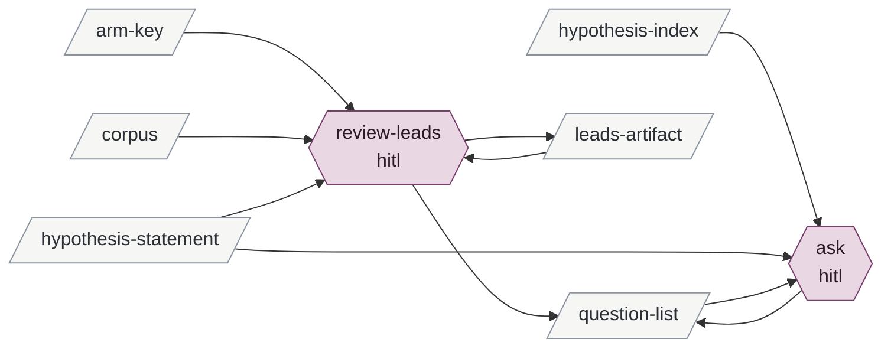

# reviewing-leads

Enables preparing-to-verify-a-corpus.

| id | mode | instruments | reads | writes | state | description |
|---|---|---|---|---|---|---|
| review-leads | hitl | git | leads-artifact arm-key corpus hypothesis-statement | leads-artifact question-list | specified | Brian and the session over a leads artifact: the arm key opened, bins drilled, leads challenged at the source and corrected, and the questions Brian raises written into the corpus's list |
| ask | hitl | git | hypothesis-index hypothesis-statement question-list | question-list | built | Ad hoc: a question Brian raises in conversation about the framework, written into a corpus's list |

<!-- generated:activity -->

Derived from the tables, never authored:

- **inputs**: arm-key corpus hypothesis-index hypothesis-statement
- **outputs**: leads-artifact question-list
- **instruments**: git
- **enabled by**: minting-a-hypothesis exploring-a-corpus
- **enables**: preparing-to-verify-a-corpus
<!-- /generated -->

## Preconditions

For `review-leads`: a leads artifact whose `## Corrections` section is empty and whose
proposed questions have not been written to any list. For `ask`: nothing; it is any hitl
session in which Brian asks a question about a corpus.

## review-leads

The session opens the leads artifact and, if the exploration had arms, the arm key, and
presents the bins with their counts now labelled by condition. Brian says which bins to
drill; for each, the session lays the disagreeing records side by side and he adjudicates;
the adjudicated result is appended to `## Bins`.

Brian challenges leads. For each, the session verifies against the corpus itself at the
lead's locus, never against the artifact, and reports what the source shows; a lead that
does not hold is recorded in `## Corrections`, dated, with what the source showed. The
lead itself is not edited.

Brian raises questions: from the artifact's `## Proposed questions`, from the drills, from
his own recall, which enters only as a question with its provenance ("Brian's recall,
<date>: does the v1 archive show X?"). The session writes each into the corpus's question
list in his words, `asked-by: review of <instance>`, with the hypotheses it concerns and a
predicate where one suggests itself. A lead that shows a different hypothesis is needed is
handed to minting-a-hypothesis in the same session. One commit.

## ask

Brian asks; the session writes the entry into the named corpus's list with
`asked-by: ad hoc`, his words, the hypotheses it concerns, a predicate if one suggests
itself. One commit.

## Never

Edits a lead; writes a candidate or evidence; rewords a hypothesis; writes a question Brian
did not ask; enters recall as anything but a question.
