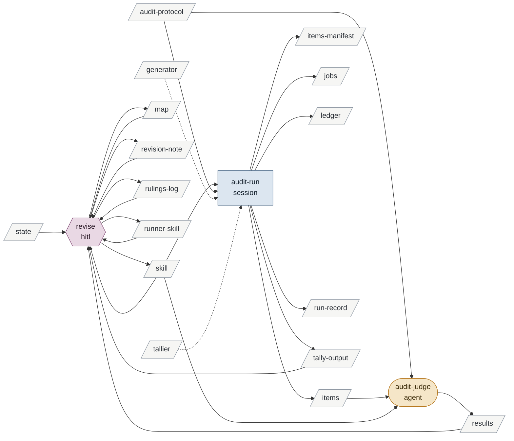

# revising-the-method

Enables preparing-to-explore-a-corpus and preparing-to-verify-a-corpus.

| id | mode | instruments | reads | writes | state | description |
|---|---|---|---|---|---|---|
| revise | hitl | ProcessMap git | skill runner-skill map state revision-note rulings-log results tally-output | skill runner-skill rulings-log revision-note map | built | Brian rules, the session edits the skill's tables and prose in place, the validator passes, the rulings are logged as made, the audit's tally is adjudicated with him, and the note is written once at the end |
| audit-run | session | runner generator tallier | skill audit-protocol | items items-manifest jobs ledger run-record tally-output | built | The second lint, after the validator, for a rewrite: the prior text split into units by the runner, one job per section against the new folder, the results tallied |
| audit-judge | agent | | audit-protocol items skill | results | built | One section's units against the new folder under the protocol's three questions; the only writer of results |

<!-- generated:activity -->

Derived from the tables, never authored:

- **inputs**: audit-protocol generator state tallier
- **outputs**: items items-manifest jobs ledger map results revision-note rulings-log run-record runner-skill skill tally-output
- **instruments**: ProcessMap generator git runner tallier
- **enabled by**: —
- **enables**: preparing-to-explore-a-corpus preparing-to-verify-a-corpus
<!-- /generated -->

## Preconditions

A finding about the method itself: the validator reports a gap, a run shows a rule does not
hold, an activity file is found wanting in use, or Brian's judgment that the method is
wrong-shaped. A revision is never triggered by a hypothesis's content.

## revise

The session names the finding and the rows or prose it touches. Brian rules; each ruling
is appended to the revision's rulings log as it is made, in his words where he gave them,
with the reason. The session applies each ruling as a row edit and a prose edit together,
in the activity file or `artifacts.md` or this router, never one without the other; a
ruling about how agent jobs are run lands in the `agent-runner` skill the same way; a
schema change (a column, a closed set, a validator rule) is a change to `SKILL.md` § Schema
and to the tool with its fixtures, and is rare.

Two lints gate a revision. The first is structure: after every step `validate`
(`tools/StoryPlanner.ProcessMap`) runs over the skill folder and must pass before the
next, and `render` regenerates the marked sections and `map.md`. The second is content, and
it runs only for a revision that rewrites the skill wholesale: every unit of the prior text
is judged against the new folder by `audit-run` and `audit-judge`, and the session
adjudicates the tally with Brian. Each unit the audit reports narrowed, reversed or absent
gets one line in the revision note's omissions list with his ruling — restored to the new
text, or superseded and why; a unit reported restated or broadened gets no line. A
revision that only changes rows runs the first lint alone.

When the revision is done, the session writes the write-once revision note: what prompted
it, the rulings, the activities and processes changed by id from the tables' diff, the
omissions list, what was deliberately not adopted, what is owed. One commit per landed
step; the note lands with the last. A revision that replaces the skill wholesale, as
revision 2 did, is built in a sibling folder and swapped in one commit when both lints have
run; a revision that changes rows is made in place.

## audit-run

Per the `agent-runner` skill, under `fanout/skill-audits/`. The prior text — the whole old
skill folder, and any rule-bearing page the revision retires outside it — is concatenated
in a stated order into one document, split by the runner's `split` verb into units with a
manifest, and the generator writes one job per section: the section's units as its items,
every file of the new folder and of the skills it delegates to as set B, the unit ids as
the output contract. Dry run; pilot on the section the revision changed most, its output
read by Brian; batch; the tallier counts verdicts per kind and flags malformed blocks.
Reads: the prior text and the protocol. Writes: the items and their manifest, the jobs,
the ledger, the tally and `run.md`, which names the files in the document and the unit
range each occupies. The rulings log is never in set B: intent is applied at adjudication,
never given to the auditor. Set B holds no instrument the revision retires, since a retired
file in B lets its own rules pass as preserved.

## audit-judge

Instructed by `fanout/skill-audits/protocol.md` and nothing else; Sonnet by default; tool
Write; no MCP. Given one section's units and set B, it answers the protocol's three
questions per unit and writes one block per unit under the unit's id.

## Never

Edits a generated section by hand; keeps two copies of a table; changes a row without its
prose or prose without its row; rewrites a rule while moving it; treats any row as settled;
swaps a rewritten skill in before both lints have run; gives the auditor the rulings log or
a retired instrument.
