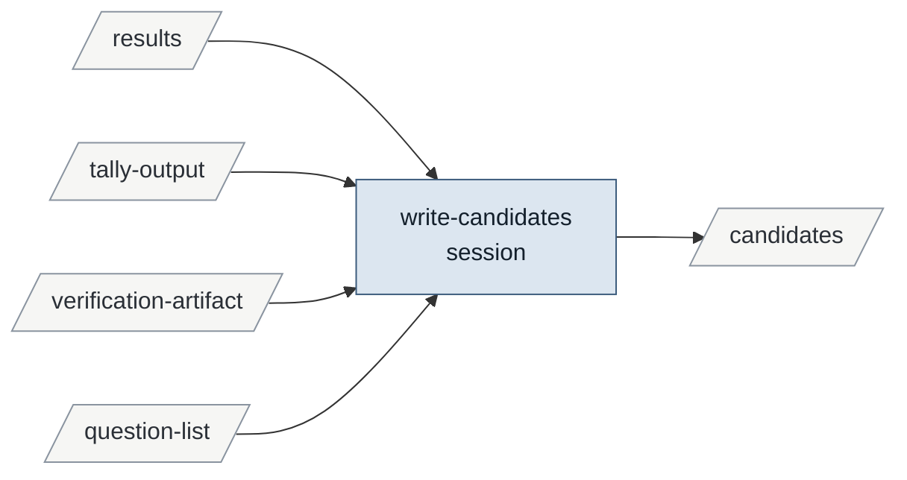

# writing-candidates-from-verification

Enables refereeing-a-candidate.

| id | mode | instruments | reads | writes | state | description |
|---|---|---|---|---|---|---|
| write-candidates | session | | results tally-output verification-artifact question-list | candidates | specified | One candidate per finding the round claims bears on a hypothesis: target, finding as one citable unit, source locator, proposer with hash |

<!-- generated:activity -->

Derived from the tables, never authored:

- **inputs**: question-list results tally-output verification-artifact
- **outputs**: candidates
- **instruments**: —
- **enabled by**: conducting-a-verification-round
- **enables**: refereeing-a-candidate
<!-- /generated -->

## Preconditions

The round's `round.md` exists with its method and counts, and its `tally.md` names the
flagged rows. The round's codebook version has a calibration record at its hash.

## write-candidates

The session reads the round's results through the tally, never the raw batch alone, and
the questions the round answered. For each result whose label bears on a hypothesis named
by one of those questions, it writes one candidate into `fanout/<instance>/candidates.md`:
`target` the hypothesis id, `finding` one citable unit (what was observed, with the ids,
counts or passages the result carries), `source` the locator the item came from, and
`proposed-by` the job id, model, time, codebook id and hash, and harness version. A result
bearing on two hypotheses is two candidates. A finding is stated as observed, not as what
it means for the hypothesis; the referee decides that.

Flagged rows are not candidates. A result the tally flagged as malformed or outside the
codebook's classes is left out and named in `round.md` § Corrections.

## Never

Writes a falsifier or a verdict; writes a candidate from a leads artifact, a result under
an uncalibrated hash, or a script's count with no item behind it; edits a candidate once
written; writes to a hypothesis file.
