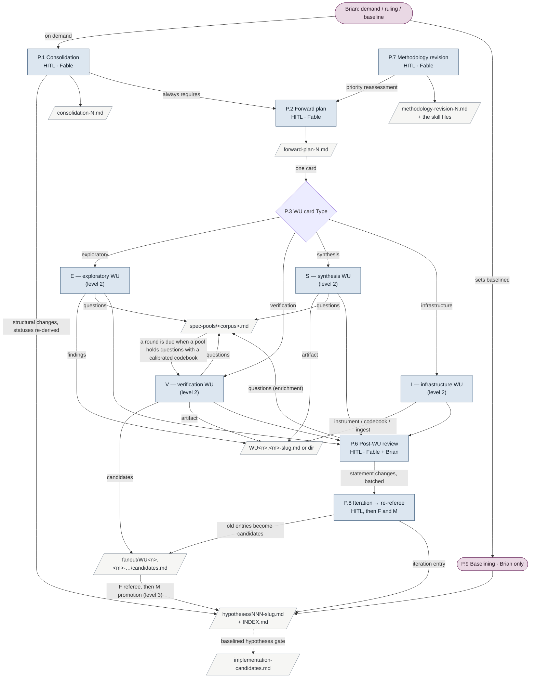
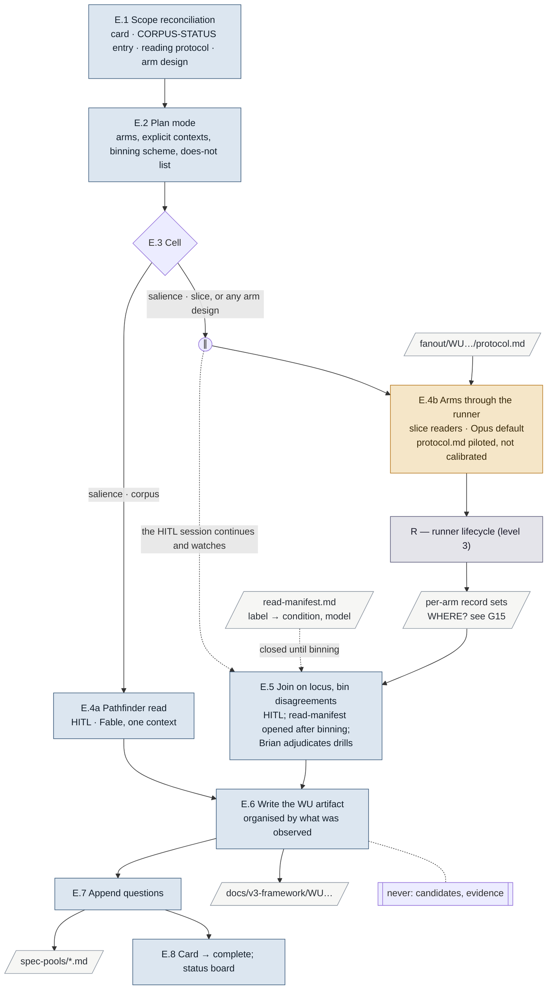
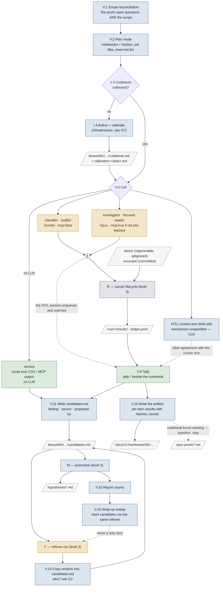
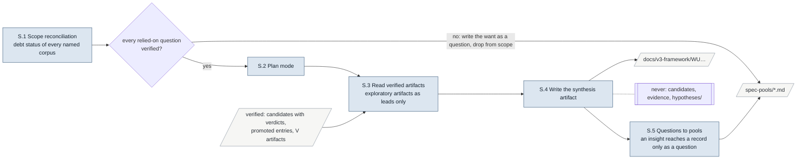
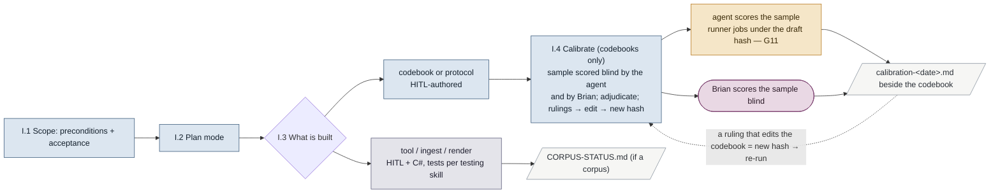
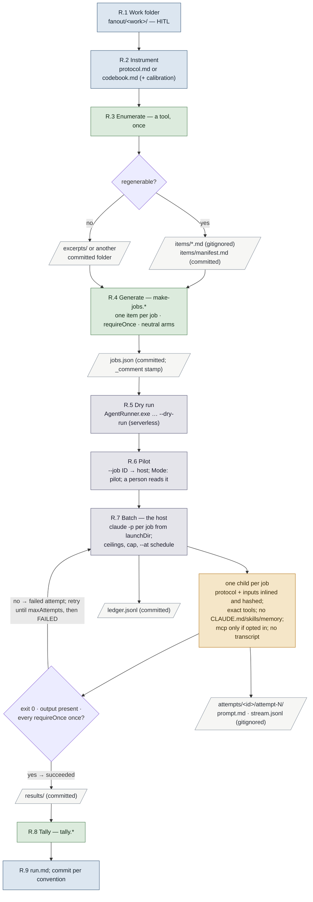
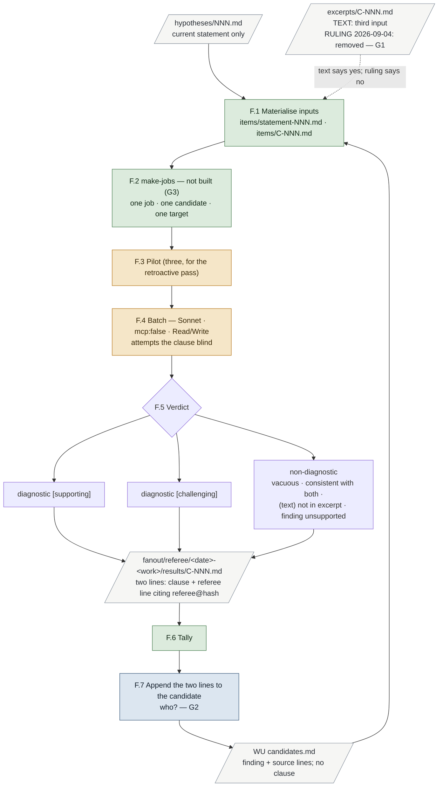
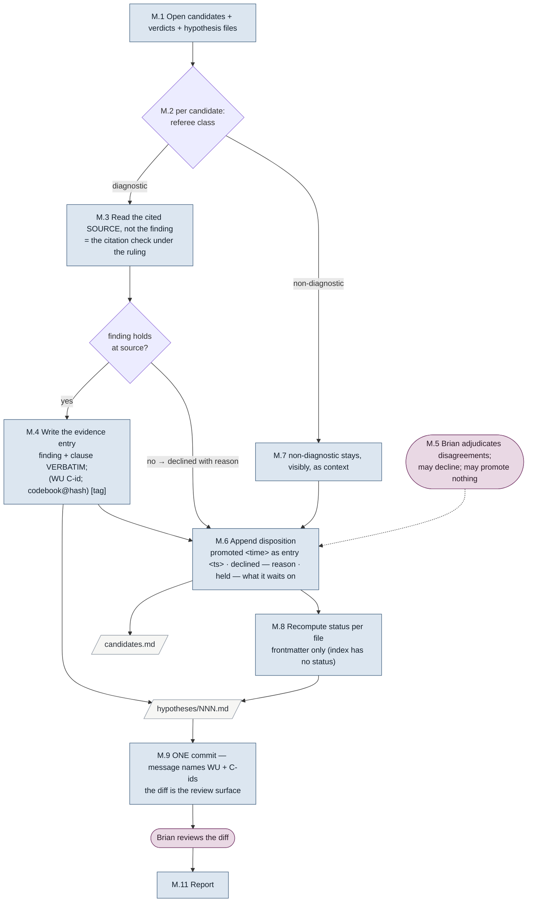

# Process map 1 — DRAFT (iterated during review; the snapshot is written when the text settles)

Drafted 2026-09-04 as step 1 of the WU2.15 plan. Maps methodology revision 1 **as the
instruction text states it on this date**, plus the one ruling of 2026-09-04 that the text
does not yet carry (referee = discrimination only, two inputs). Sources are instruction text
only — never a transcript — and every node attribute cites its governing sentence by file and
section. A node attribute with no citation, two citations that disagree, or text that does
not match Brian's stated intent is a row in § Gaps.

**Sources:** `.claude/skills/v3-buildout/{SKILL.md, evidence-pipeline.md, wu-execution.md,
hypothesis-records.md, forward-plans.md, consolidation.md}`, `.claude/skills/agent-runner/SKILL.md`,
`fanout/PROTOCOL.md`, `fanout/README.md`, `fanout/referee/codebook.md`,
`docs/v3-framework/spec-pools/README.md`, `docs/v3-framework/forward-plan-2.md` (the WU2.15 card
and the cards that name cells), `docs/v3-framework/retroactive-referee-pass-handoff.md`,
CLAUDE.md § Two AI roles (third role).

**Reading the diagrams.** Rectangles are processes; slanted boxes are files; diamonds are
exclusive choices the text makes; a circle marked ∥ is a fork whose branches run at once and
join later; a dashed edge is optional. Colour is the actor kind: **Brian**, **HITL session**
(model named), **autonomous agent** through the runner (model named), **script** (PowerShell
beside an instrument), **C# tool**. The legend state of each node — exists · specified not
built · contradictory — is in the node tables, not the picture.

Node ids: `P.n` the buildout cycle · `E.n` `V.n` `S.n` `I.n` the four WU types · `R.n` a runner
run · `F.n` the referee run · `M.n` promotion.

---

## Level 1 — the buildout cycle

### Level-1 nodes

| Id | Process | Actor | Inputs | Outputs | Governing text | State |
|---|---|---|---|---|---|---|
| P.1 | Consolidation | HITL session, Fable; on Brian's demand | `INDEX.md`, every hypothesis file, active plan, every spec pool | Hypothesis files (iteration entries, new files, `challenged` on superseded), `consolidation-N.md`, `INDEX.md`, re-pointed pool entries and plan references | `consolidation.md` (whole) | exists (consolidation-1 done) |
| P.2 | Forward plan creation / revision | HITL session, Fable | Full index, every hypothesis file, the consolidation report when one just happened; entries lacking referee lines read as unverified | `forward-plan-N.md`; header stamp on the retired plan | `forward-plans.md` § Numbering, § Writing the plan | exists (plan 2) |
| P.3 | Choose WU by card | HITL (the WU's own session reads its card) | One card of the active plan | The WU's type, corpus, scale (= matrix cell) | `forward-plans.md` § Structure; `PROTOCOL.md` step 2 | exists |
| P.6 | Post-WU review | HITL, Fable, with Brian; two modes, challenge and enrichment | The WU artifact; the source when challenged | Corrections appended to the artifact; pool questions; statement changes batched | `wu-execution.md` § 4. Post-WU review | exists |
| P.7 | Methodology revision | HITL, Fable | The skill and its companions; the prompting evidence | Rewritten skill files; `methodology-revision-N.md` (write-once) | Recorded by `methodology-revision-1.md`; **no protocol governs how one is run** (SKILL.md § Provenance only lists the file) | gap G10 |
| P.8 | Iteration → re-referee | HITL writes the iteration entry; then F and M | The changed statement; every evidence entry under the old wording | New candidates file `fanout/referee/iterations/NNN-<date>/candidates.md`; re-promoted entries; old entries marked `(superseded by re-referee <date>)` | `evidence-pipeline.md` § Iteration → re-referee; `hypothesis-records.md` § Ceremony scaling | specified; never run |
| P.9 | Baselining | Brian only | His judgment of the evidence picture | `baselined: <date>` in frontmatter; a `baselined` record entry in his words | SKILL.md § Epistemic framework; `hypothesis-records.md` § Record entries | exists (mechanism); none baselined |
| — | Status board | The WU session, by hand, in the same commit as the card | The cards' `Status` fields | The board in the plan | `forward-plans.md` § Ordering is structural (last paragraph) | exists; hand-kept (see G17) |

---

## Level 2 — the four WU types

All four run the same four phases in a HITL session on Fable: scope reconciliation → plan mode
(questions batched, plan written, Brian approves) → execution → post-WU review
(`wu-execution.md` § The four phases). Phases 1 and 3 differ by type and are drawn; 2 and 4 are
P-level nodes.

### E — exploratory

| Id | Process | Actor | Inputs | Outputs | Governing text | State |
|---|---|---|---|---|---|---|
| E.1 | Scope reconciliation | HITL, Fable | Card; the corpus's `CORPUS-STATUS.md` entry; the reading protocol; the arm design | Protocol and arms confirmed; the card's hypothesis list is informational only | `wu-execution.md` § 1 table, exploratory row | exists |
| E.2 | Plan mode | HITL, Fable; Brian approves | Sources sized via `CORPUS-STATUS.md` | Plan: what is read in what order, arms and explicit contexts, binning scheme, artifact coverage, does-not list | `wu-execution.md` § 2 | exists |
| E.3 | Cell choice | HITL | The card's `Scale` | Pathfinder (HITL) or slice-reader arms (runner) | SKILL.md § Work matrix; `wu-execution.md` § Four types, exploratory row | exists |
| E.4a | Pathfinder read | HITL, Fable | The whole corpus in one context | Leads only — "an index of where to look, never a finding" | SKILL.md § Work matrix, verification owed | exists (WU1.1 was one) |
| E.4b | Reading arms | Autonomous agents via runner; Opus default; Fable/Opus/Sonnet in a factorial | `protocol.md` (a reading protocol, **piloted not calibrated**) + one arc/subject file per job; tools Read/Write; no MCP | One record set per arm, neutral label | `wu-execution.md` § Design rules (arms and blinding); `forward-plan-2.md` § Codebooks (last paragraph); WU2.5 card | specified; WU2.5 not run |
| E.5 | Join and bin | HITL, Fable; Brian adjudicates drills | Record sets; `read-manifest.md` opened only after binning | Bin counts (findings); merge list; adjudicated drills | `wu-execution.md` § Design rules (binning) | specified |
| E.6 | Write the artifact | HITL, Fable | Records, bins, drills | `docs/v3-framework/WU<n>.<m>-<slug>.md` or directory; write-once; method section names protocol hash, arms, harness, models, manifest | `wu-execution.md` § WU artifacts | exists (WU1.1, WU1.3) |
| E.7 | Append questions | HITL | Anything the read raised, for any corpus | Entries in `spec-pools/<corpus>.md` (question · asked-by · bears-on · candidate-predicate · status) | `spec-pools/README.md`; `wu-execution.md` § 3 exploratory row | exists |
| E.8 | Complete | HITL | — | Card `Status: complete`; status board row | `wu-execution.md` § 3; `forward-plans.md` § Ordering (status board) | exists |

### V — verification

| Id | Process | Actor | Inputs | Outputs | Governing text | State |
|---|---|---|---|---|---|---|
| V.1 | Scope reconciliation | HITL, Fable | Card; the corpus's spec pool; named codebooks and calibration records | Hypothesis list recomputed from the pool's `bears-on`; codebooks without a calibration record flagged as the first task | `wu-execution.md` § 1 table, verification row | exists |
| V.2 | Plan mode | HITL; Brian approves | Pool questions; codebooks | Plan naming codebooks and hashes, job files, does-not list | `wu-execution.md` § 2 | exists |
| V.3 | Calibrated? | HITL | The codebook folder | Branch | SKILL.md rule 4; `PROTOCOL.md` step 4 | exists |
| V.4 | Cell choice | HITL | The card's `Scale` | classifier / auditor (Sonnet), investigator / focused reader (Opus), census (script), and the 049 HITL-context arm | SKILL.md § Work matrix (model doctrine); WU2.6, WU2.8, WU2.10 cards | exists |
| Vc | Classifier / auditor job | Autonomous agent, Sonnet, `mcp: false`, tools Read/Write | Codebook + one item (+ committed excerpts when not regenerable) | One labelled result under `requireOnce` | SKILL.md rule 5; `agent-runner` § A well-formed job | exists (skill audit ran one) |
| Vi | Investigator / focused reader job | Autonomous agent, Opus; `mcp: true` only when the item is not pre-fetched | Protocol + the fixed question + the item or subject set; the MCP config when opted in | A located answer with loci and dates; absence is a finding | SKILL.md § Work matrix; WU2.10, WU2.6 cards | specified; none run |
| Vs | Census | Script (PowerShell / sqlite / CSV), no LLM | `attribution.csv`, MCP output, adjudication bins | A table in the artifact; **candidates written directly** (WU2.6: "computed … by script and written as candidates") | WU2.6 card § Scope; `wu-execution.md` says nothing about script-produced candidates | gap G8 |
| Vh | HITL-context arm | "the only cell in the plan where an agent deliberately carries CLAUDE.md" | Same items and codebook hash as the runner arm | Labels, compared for agreement | WU2.6 card § Codebooks | gap G23 |
| V.9 | Tally | Script beside the instrument | `results/` | Counts and flagged rows; "adjudication reads this, never the raw batch" | `PROTOCOL.md` step 10; `agent-runner` § A well-formed job (conventions) | exists for skill audits; per-work otherwise |
| V.10 | Write the artifact | HITL | Tally, ledger | `docs/v3-framework/WU…` with per-item results, codebook hashes, counts, tables | `wu-execution.md` § Four types, verification row; § WU artifacts | specified |
| V.11 | Write candidates | HITL session (or a census script) | Tally / results | `fanout/WU<n>.<m>-…/candidates.md`, append-only: `## C-NNN` · target · status · finding · source · proposed-by (arm or job id / model / time / codebook@hash / harness) | `evidence-pipeline.md` § The candidates file | specified; none written yet |
| V.13 | Copy verdicts | Contradictory: the referee "appends to the same candidate" (`evidence-pipeline.md` table) vs "the promotion session copies each verdict from results/" (handoff step 3; WU2.15 card) | `results/` of the referee run | The two appended lines per candidate | as cited | gap G2 |
| V.15 | Report | HITL, after the commit | The candidates file | Candidates per target; class split; promoted supporting/challenging; declines; referee disagreements; pipeline behaviour | `evidence-pipeline.md` § Promotion (last paragraph) | specified |
| V.16 | Wrap-up sweep | HITL | Full hypothesis index | More candidates, through the same referee only | `wu-execution.md` § 3 table, verification row | specified |

### S — synthesis

| Id | Process | Actor | Inputs | Outputs | Governing text | State |
|---|---|---|---|---|---|---|
| S.1 | Scope reconciliation | HITL, Fable | Card; each named corpus's debt status (exploratory done? rounds run? questions answered?) | Scope limited to verified questions; the rest written as questions | `wu-execution.md` § 1 table, synthesis row; § The corpus pair | exists |
| S.3–S.5 | Read, write, question | HITL, Fable ("a pathfinder whose corpus is the buildout's own outputs") | Verified artifacts; exploratory artifacts as leads | Artifact; pool questions; never `hypotheses/` | `wu-execution.md` § Four types, synthesis row; § 3 | specified; none can run yet |

### I — infrastructure

| Id | Process | Actor | Inputs | Outputs | Governing text | State |
|---|---|---|---|---|---|---|
| I.1–I.3 | Scope, plan, build | HITL + code; tests per the `testing` skill | The thing to build and what consumes it | An instrument, an ingest, a render, a codebook and its calibration record, `CORPUS-STATUS.md` update | `wu-execution.md` § Four types, infrastructure row; § 1 table | exists (many built) |
| I.4 | Calibrate a codebook | HITL authors; agent scores blind (runner); Brian scores blind; HITL adjudicates | Sample of items or candidates (≥ 20 spanning the classes and ≥ 3 hypotheses for the referee) | `calibration-<date>.md` (sample ids, both verdicts, agreement per class, rulings); edited codebook at a new hash | SKILL.md rule 4; `codebook.md` § Calibration; `PROTOCOL.md` step 4; `agent-runner` rule 4 ("calibration is the pilot for a codebook") | **none exists**; gaps G12, G13, G14 |

---

## Level 3 — the runner, the referee, promotion

### R — a runner run (`PROTOCOL.md` steps 3–10 and 12; every autonomous cell, every arm)

| Id | Process | Actor | Inputs | Outputs | Governing text | State |
|---|---|---|---|---|---|---|
| R.1 | Work folder | HITL | The work (a WU id or an action name) | `fanout/<work>/`, vertical by work | `agent-runner` § Layout; `PROTOCOL.md` step 3 | exists |
| R.2 | Instrument | HITL | — | `protocol.md` (exploratory arms; piloted) or `codebook.md` + `calibration-<date>.md` (frozen predicate; calibrated) | SKILL.md rule 4; `PROTOCOL.md` step 4; `forward-plan-2.md` § Codebooks | exists (referee draft; skill-audit protocol) |
| R.3 | Enumerate | A tool, once (`split` for Markdown; otherwise the work's own script) | The source | `items/` + `manifest.md` when regenerable; a committed folder when not; "the agent never enumerates its own items" | `agent-runner` rule 2; § The split verb; `PROTOCOL.md` step 5 | exists |
| R.4 | Generate | `make-jobs.*` beside the instrument | The manifest | `jobs.json`: one `item` per job, `requireOnce`, ceilings, neutral arm names, `_comment` stamp | `agent-runner` rules 1, 3; § The job file | exists for skill audits; **not for the referee** (G3) |
| R.5 | Dry run | C# CLI, serverless | `jobs.json` | Every prompt composed and sized; nothing launched | `PROTOCOL.md` step 7 | exists |
| R.6 | Pilot | CLI `--job` → host | One job | One attempt, `Mode: pilot`, read by a person | `agent-runner` rule 4; `PROTOCOL.md` step 8 | exists |
| R.7 | Batch | The host (`http://127.0.0.1:5190`), harness control only | `jobs.json`; the host's and the run's ceilings and cap | `ledger.jsonl`, `attempts/`, `results/`; page and JSON routes; `--at` scheduling | `agent-runner` § The host and its page; § Invariants | exists |
| child | One job | Autonomous agent, `claude -p` from `launchDir` (outside the repo) | `# Job`, `Item`, instructions, output contract, protocol and input files under hashed headings; exact `tools`; MCP only with `mcp: true` | `outputPath` written; checked by `requireOnce`; failed on miss, timeout, or exit ≠ 0; at most `maxAttempts` | SKILL.md rule 5; `agent-runner` § What the agent sees; § Invariants | exists |
| R.8 | Tally | `tally.*` beside the instrument | `results/` | Counts, flagged rows | `PROTOCOL.md` step 10 | exists per work |
| R.9 | Record | HITL | The run | `run.md` (work, question ids, cell, instrument hash at calibration, arms, not-measured, where adjudication lives); commit: `attempts/` never, `items/*` never except the manifest, everything else | `PROTOCOL.md` step 12, § run.md; `agent-runner` § What a run commits | exists |

### F — the referee run (a runner run under `fanout/referee/codebook.md`, nested at `PROTOCOL.md` step 11)

| Id | Process | Actor | Inputs | Outputs | Governing text | State |
|---|---|---|---|---|---|---|
| F.1 | Inputs | HITL / generator script | Statement (no status, no record, no other candidates); the candidate's finding and source; **the cited source excerpt** per text | Item files | `evidence-pipeline.md` § The referee ("inputs are exactly three"); `codebook.md` § What you are given | **contradictory with the 2026-09-04 ruling** — G1 |
| F.2 | Generate | `fanout/referee/make-jobs.*` | `candidates.md` + the sample list | `jobs.json`; `requireOnce` = the two verdict-line markers | handoff step 3; WU2.15 card | not built — G3 |
| F.3–F.4 | Pilot, batch | Autonomous agent, Sonnet, `mcp: false`, tools Read/Write | Codebook + inputs; never a clause anyone else wrote | Two lines per candidate | `evidence-pipeline.md` § The referee; `codebook.md` § What you produce | specified; never run |
| F.5 | Verdict | The agent, per R1–R9 | — | `diagnostic [supporting]` / `diagnostic [challenging]` / `non-diagnostic`, tag mechanical from the clause; tuned to over-flag; one target per candidate | `codebook.md` § Classes, § Decision rules | draft, uncalibrated |
| F.6 | Tally | `fanout/referee/tally.*` | `results/` | Class counts; malformed verdicts flagged | handoff step 3 | not built — G3 |
| F.7 | Append to candidate | see G2 | `results/` | The candidate's `clause:` and `referee:` lines | `evidence-pipeline.md` § The candidates file (referee append) | contradictory — G2 |

### M — promotion (HITL, Fable; Brian reviews the commit)

| Id | Process | Actor | Inputs | Outputs | Governing text | State |
|---|---|---|---|---|---|---|
| M.1–M.4 | Promote | HITL, Fable | Candidates file, verdicts, hypothesis files; the cited source read before promoting | Evidence entry: `- evidence \| <ts> \| (WU<n>.<m> C-NNN; codebook <name>@<hash>) [tag]: <finding> Would differ if false: <clause>` — both verbatim | `evidence-pipeline.md` § Promotion; `hypothesis-records.md` § Record entries (evidence) | specified; never run |
| M.5 | Adjudicate | Brian | Referee disagreements | Declines with reason; or nothing promoted | `evidence-pipeline.md` § Promotion | specified |
| M.6 | Disposition | HITL | — | `- disposition: promoted … \| declined — … \| held — …` appended; status derived from the last append | `evidence-pipeline.md` § The candidates file | specified |
| M.8 | Status | HITL (a computation) | The file's entries | `status: untested \| evidenced \| challenged` in frontmatter; `baselined` resets to `false` when a challenging entry lands | SKILL.md § Epistemic framework; `hypothesis-records.md` § Files and the index | specified |
| M.9 | Commit | HITL; Brian reviews | — | One commit naming the WU and candidate ids | `evidence-pipeline.md` § Promotion | specified |
| M.11 | Report | HITL, after the commit | — | Per-target counts, class split, promoted by tag, declines, disagreements, pipeline behaviour; Brian decides on a recheck | `evidence-pipeline.md` § Promotion | specified |

---

## Gaps

Keyed by node id. Kind: **missing** (attribute with no citation) · **contradiction** (citations disagree) · **intent** (text does not match Brian's stated intent) · **unbuilt** (specified, not built). Status: open · ruled (date) · fixed in <file § section>.

| # | Node | Kind | Gap | Status |
|---|---|---|---|---|
| G1 | F.1 | intent + contradiction | The codebook (§ What you are given) and `evidence-pipeline.md` (§ The referee, "inputs are exactly three") give the referee a source excerpt and rules R2/R5/R6 around it. Brian ruled 2026-09-04: referee = discrimination only, two inputs; citation support belongs to the experiment's instrument and to M.3. | ruled 2026-09-04; fix pending step 2 |
| G2 | F.7 / V.13 | contradiction | `evidence-pipeline.md` § Where each kind of write goes: the referee appends its verdict to the candidate. Handoff step 3 and the WU2.15 card: the promotion session copies each verdict from `results/`. A runner child cannot safely append to a shared file; the second is workable. | open |
| G3 | F.2, F.6 | unbuilt | `fanout/referee/make-jobs.*` and `tally.*` named by the handoff and card do not exist; only `fanout/skill-audits/` has a pair. | open (Session A work) |
| G4 | R.3 | intent | `agent-runner` SKILL.md § What a run commits uses "a source excerpt fetched from a database for the referee" as its example of a non-regenerable input. Under G1's ruling the example should be an experiment input (e.g. flagged notes fetched for a WU2.6 focused reader). | open |
| G5 | R / E / S | missing | `PROTOCOL.md` presents one lifecycle. Its steps 1–2 and 11 fit a verification WU only: an exploratory run *produces* questions (step 1 inverted) and ends in adjudication, not verify-and-promote; a synthesis has no run at all. It also does not say that the referee run is itself a full R-lifecycle nested at step 11, or that the candidate's citation record is produced at step 10 and travels to step 11. | open |
| G6 | F.1 | missing | The two plan-mode answer rounds of 2026-09-03 (02:47, 04:15) are elided in `codesessions.db`, so the record cannot show whether Brian ruled on the referee's inputs then. Only Brian can say. | open (Brian) |
| G7 | V.3 / I.4 | contradiction | Who authors and calibrates a corpus codebook? `wu-execution.md` § Design rules: "Codebooks are not written by the pass that applies them … calibration precedes any batch"; § Four types, verification row: never writes "a codebook revision (that is a HITL task)". `forward-plan-2.md` § Why this shape: "codebooks and calibrations live inside the verification cards that use them, as the first task"; § 1 reconciliation table: "codebooks without a calibration record are flagged as the first task". Infrastructure row: writes "a codebook and its calibration record". Three owners named. | open |
| G8 | Vs / V.11 | missing | A census (script, no LLM) "written as candidates" (WU2.6 card) has no arm, job id, model, codebook hash or harness version — but `evidence-pipeline.md` § The candidates file requires `proposed-by: <arm or job id> / <model> / <time> / codebook <name>@<hash> / harness <version>`. What a script-produced candidate cites is unspecified. | open |
| G9 | Vi / M.3 | missing | An investigator's candidate cites loci it found at runtime. Under the ruling, promotion reads the source; but what the investigator must record (locus ids, the fetch, the whole unit) so that M.3 can read it is unspecified. `agent-runner` § What a run commits covers storage, not content. | open |
| G10 | P.7 | missing | No text governs how a methodology revision is run (trigger, who, what it reads, what it must produce beyond the note). `methodology-revision-1.md` records one; SKILL.md § Provenance lists the file kind. | open |
| G11 | I.4 / F.3 | contradiction | Handoff § Must not: never "run the batch under an uncalibrated codebook hash". `codebook.md` § Calibration: the sample is "scored blind by the referee" — which is a run of ≥ 20 jobs under the draft hash. `agent-runner` rule 4: "calibration is the pilot for a codebook". The calibration run needs a name and a rule distinguishing it from a batch (e.g. `Mode: calibration` on its ledger rows). | open |
| G12 | I.4 | missing | The calibration record's contents are specified (`codebook.md` § Calibration) but not the mechanics of Brian's blind scoring: where he writes verdicts, how "independently" is enforced (results withheld), and who adjudicates. | open (the plan proposes a scoring sheet in the run folder) |
| G13 | I.4 / R.2 | missing | The host's stage detector marks a codebook "calibrated" when any `calibration-*.md` sits beside it (`codebook.md` line 3; `PROTOCOL.md` § What the page shows). A codebook edited after calibration (new hash) with the old record beside it still shows calibrated; nothing checks that the record names the current hash. | open |
| G14 | I.4 | missing | A calibration is scored by "the referee" under the doctrine model (Sonnet). Whether a calibration is per (codebook hash) or per (codebook hash, model) is unstated; a later run under Opus would cite a calibration that never scored Opus. | open |
| G15 | E.4b / R.7 | contradiction | Where exploratory arm outputs live. `agent-runner` § Layout: `results/` under the run folder in `fanout/`. WU2.5 card § Artifact: "`WU2.5-v1-exploratory/` (directory): … the per-arm record sets as delivered (never edited)" under `docs/v3-framework/`. Two homes for the same files. | open |
| G16 | E.7 / V.11 | missing | Spec-pool entries carry `status: open \| folded-into \| answered-by WU<n>.<m> \| withdrawn` (`spec-pools/README.md`), but no process node updates a pool entry's status after a verification round answers it; `wu-execution.md` § 3 only appends questions. | open |
| G17 | P status board / M.9 | missing | The card `Status` and status board are updated "in the same commit as the card" (`forward-plans.md`); promotion is "one commit" whose diff is the review surface (`evidence-pipeline.md`). Whether the card update rides in the promotion commit or a second one is unstated. | open (the plan assumes a second small commit) |
| G18 | all WU types | contradiction | `wu-execution.md` § The four phases: "Every WU of every type runs the same four phases in one HITL session (Fable)". WU2.5 (two adjudication sessions plus synthesis) and WU2.15 (three sessions with Brian's scoring between) span several sessions by design. | open |
| G19 | Vh | missing | The 049 "HITL-context arm" — "the only cell in the plan where an agent deliberately carries CLAUDE.md" (WU2.6 card) — has no mechanism: the runner refuses a repo `launchDir`, and the Agent tool is ruled out for arms (`agent-runner` § Two mechanisms). | open |
| G20 | E.4b | intent? | Exploratory reading protocols are "piloted, not calibrated" (`forward-plan-2.md` § Codebooks). A pilot is one job read by a person; nothing states what a pilot must show for the protocol to proceed. | open |
| G21 | M.3 | missing (post-ruling) | Under the ruling M.3's source read is the citation check, but `evidence-pipeline.md` § Promotion does not record it: the disposition line has no field for what was read. | open; fix pending step 2 |
| G22 | R.2 | missing | The referee codebook's status line says "draft, uncalibrated"; no text says what replaces it after calibration or that the status line itself is part of the hashed file (an edit to it is a new hash). | open |
| G23 | P (plan mode, all WU types) | missing | Plan-mode rulings leave no durable record: AskUserQuestion answers are elided from `codesessions.db`, and the plan file lives in `~/.claude/plans/` outside the repo. No text says an approved plan is saved into the repo or that rulings are logged in it. `WU2.15-plan.md` is the first saved plan; the 2026-09-03 plan is the evidence for G6 and is not in the repo. | open (Brian) |
| G24 | all WU types | intent | Brian requires every first-run WU to tag each step SOP / one-time / reactive with a rationale, so bootstrapping is never mistaken for procedure. `wu-execution.md` has no such requirement. | open |

## Changelog

- 2026-09-04 — first draft, for Brian's review (step 1 of the WU2.15 plan). Seeded gaps G1–G6 from the plan; G7–G22 found while drawing; G23–G24 added at session close from the carry-forward list in `WU2.15-plan.md`.
